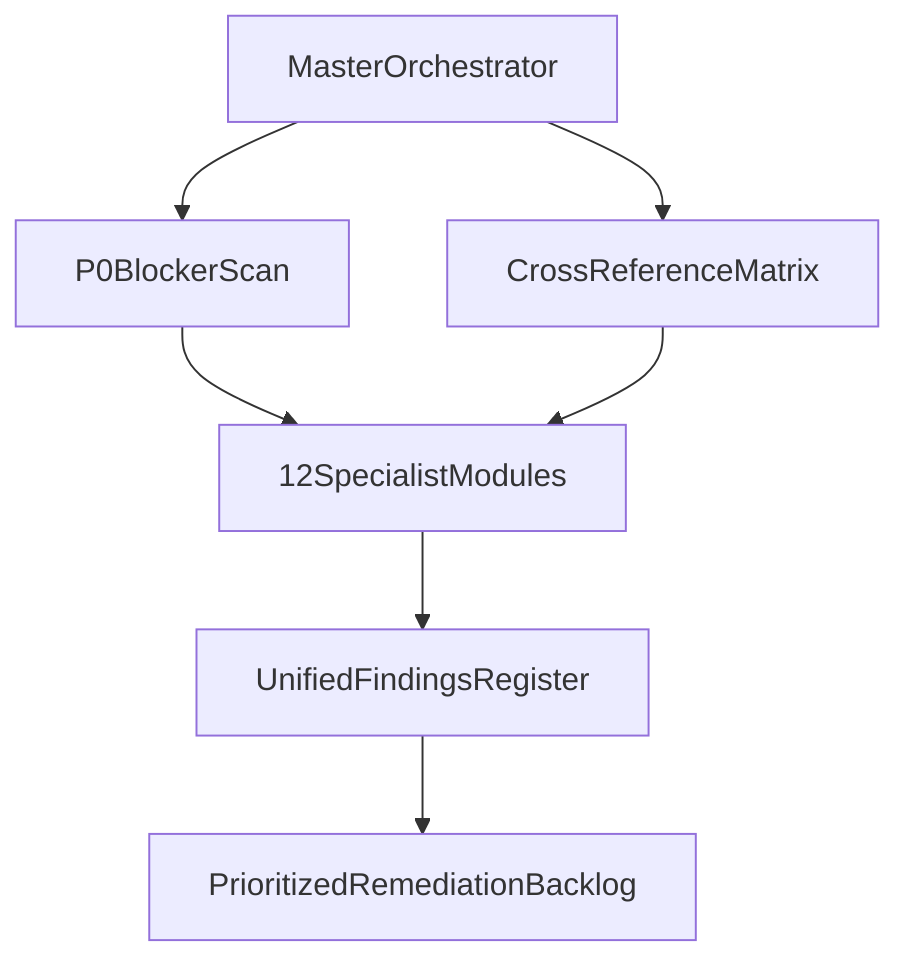
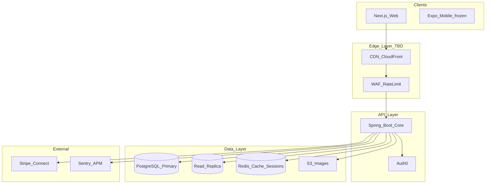

# EUshop Enterprise Readiness: Mega-Prompt + Full Remediation Plan

## Current State (Ground Truth)

EUshop is an **MVP-stage EU specialty food marketplace** (Next.js 16 + Spring Boot 3.2 + PostgreSQL 16) with strong domain intent (GDPR/DSA/DAC7, allergen compliance, marketplace entities) but **critical production blockers**:

| Blocker | Impact | Key Files |
|---------|--------|-----------|
| SQL schema ↔ JPA entity mismatch | Runtime failures on real DB | [`db/migrations/`](db/migrations/), [`services/core-service/src/main/java/com/eushop/core/entity/`](services/core-service/src/main/java/com/eushop/core/entity/) |
| Mock auth + header-trust model | Anyone can impersonate users | [`services/api-gateway/src/middleware/auth.ts`](services/api-gateway/src/middleware/auth.ts), all `*Controller.java` |
| Client-controlled payment amounts | Financial fraud vector | [`PaymentController.java`](services/core-service/src/main/java/com/eushop/core/controller/PaymentController.java), [`checkout.tsx`](apps/web/pages/checkout.tsx) |
| Broken wiring (HTTP 405, duplicate mappings, missing Stripe deps) | Features fail at runtime | [`UserController.java`](services/core-service/src/main/java/com/eushop/core/controller/UserController.java), [`apps/web/package.json`](apps/web/package.json) |
| Docs overstate maturity | Investor diligence deal-breaker | Legacy phase docs vs [`STATUS.md`](STATUS.md), [`eushop-readiness-audit-and-plan.md`](eushop-readiness-audit-and-plan.md) |

Existing asset: [`eushop-readiness-audit-and-plan.md`](eushop-readiness-audit-and-plan.md) already covers 11 business/technical tracks — the mega-prompt will **extend and operationalize** this, not replace it.

---

## Deliverable 1: Master Audit Mega-Prompt

Create [`docs/MASTER_AUDIT_PROMPT.md`](docs/MASTER_AUDIT_PROMPT.md) — a single orchestrator prompt with embedded specialist modules, each pre-loaded with EUshop context.

### Orchestrator Structure

### EUshop Context Block (injected into every module)

Every sub-prompt receives this fixed context:

- **Product:** B2C EU specialty food marketplace; 15% platform commission; Stripe Connect planned
- **Stack:** pnpm monorepo, Next.js 16 (port 3002), Spring Boot 3.2 (3001), Express gateway (3000, legacy), PostgreSQL 16, Redis 7 (unused)
- **Compliance surface:** GDPR, DSA Art. 30, DAC7, EU Food Information Reg. (14 allergens), 14-day withdrawal
- **Readiness tiers:** P0 (diligence blockers) → P1 (launch/fundraise) → P2 (operations) → P3 (scale to 100M users)
- **Known gaps:** Schema drift, mock auth/payments, no Spring Security, no webhooks, minimal tests, empty `infrastructure/`

### 12 Specialist Modules (from your templates, EUshop-customized)

| # | Role Lens | EUshop Focus Areas | Output Format |
|---|-----------|-------------------|---------------|
| 1 | **Code Review** | Controllers, DTO validation gaps, duplicate mappings | Severity table + line refs |
| 2 | **App Security** | OWASP on auth headers, payment tampering, CORS `*`, localStorage sessions | CWE-tagged findings |
| 3 | **Integration Architect** | Auth0, Stripe Connect, webhook idempotency, retry params | Architecture doc + params |
| 4 | **Principal Architect** | Gateway vs Spring-direct (decision gate post-P0), monolith vs split | ADR with 2-3 options |
| 5 | **Database Architect** | Schema reconciliation, indexes, N+1, migration strategy | DDL + ERD |
| 6 | **Performance Engineer** | LIKE search, view-count write-on-read, HikariCP tuning | Impact/effort ranked list |
| 7 | **DevOps Architect** | CI gaps, missing core-service Dockerfile, no staging/prod pipeline | YAML + runbook |
| 8 | **Supply Chain Security** | No Dependabot, missing `pnpm-lock.yaml`, undeclared Stripe deps | CVE-prioritized upgrades |
| 9 | **Testing Strategist** | 4 test files today; checkout/auth/order paths untested | Pyramid + top-10 cases |
| 10 | **Debugging Expert** | Schema mismatch symptoms, become-seller 405, Spring mapping conflict | Hypothesis-driven diagnostics |
| 11 | **DX / Onboarding** | Port conflicts (3000/3001/3002), docs drift, setup path | 30-day onboarding guide |
| 12 | **Legal/Compliance** | Impressum missing, cookie consent cosmetic, no DSAR API | Compliance checklist |

### Cross-Reference Matrix (redundancy analysis)

The orchestrator runs a dedup pass mapping findings across modules:

- Auth issues: modules 1, 2, 3, 4 overlap → single **Auth Track** owner
- Payment issues: modules 1, 2, 3, 5 overlap → single **Payments Track** owner
- Schema issues: modules 1, 5, 6, 10 overlap → single **Schema Track** owner

Output: one **Unified Findings Register** (CSV/JSON schema) with columns: `id, severity, category, module_sources[], file, line, description, remediation, phase, status`.

### Optional Cursor Integration

Add [`.cursor/rules/eushop-enterprise-readiness.mdc`](.cursor/rules/eushop-enterprise-readiness.mdc) referencing the mega-prompt so future agent sessions auto-load EUshop context and severity gates.

---

## Deliverable 2: P0 Fixes (Parallel with Prompt Creation)

Execute immediately — these are prerequisites for any architecture decision:

### P0-A: Schema Single Source of Truth

**Decision:** Align JPA entities to SQL migrations (migrations are the contract; entities drifted toward Auth0/KYBC design).

1. Audit every column in [`001_initial_schema.sql`](db/migrations/001_initial_schema.sql) + [`002_compliance_fields.sql`](db/migrations/002_compliance_fields.sql) against all 8 entities
2. Create `003_entity_alignment.sql` for any additive columns entities need (`auth0_sub`, `view_count`, etc.) — **never** silently drop compliance columns
3. Fix ID strategy inconsistency (`Conversation` uses IDENTITY; SQL uses UUID)
4. Update [`db/scripts/migrate.js`](db/scripts/migrate.js) + [`seed.js`](db/scripts/seed.js) to run all migrations and fix seed allergen gaps
5. Add CI step: `migrate + seed + mvn test` against fresh Postgres

### P0-B: Security Foundation

1. Add `spring-boot-starter-security` + JWT filter validating Auth0 RS256 tokens on **every** core-service endpoint
2. Remove trust on raw `X-User-Id` headers; derive identity from validated JWT claims
3. Fail fast if `USE_MOCK_AUTH=true` or placeholder secrets in production profile
4. Add `@PreAuthorize` / ownership checks on: orders, users, conversations, notifications, admin routes
5. Restrict CORS to `FRONTEND_URL` only (remove `@CrossOrigin(origins = "*")`)

### P0-C: Payment Integrity

1. Server-side cart validation: recalculate totals from DB food prices in `OrderService` / `PaymentService`
2. Block order creation until Stripe webhook confirms `payment_intent.succeeded`
3. Add idempotency keys on payment + order creation
4. Fix missing deps in [`apps/web/package.json`](apps/web/package.json): `@stripe/stripe-js`, `@stripe/react-stripe-js`
5. Implement webhook handler in core-service with signature verification

### P0-D: Broken Wiring

| Bug | Fix |
|-----|-----|
| `PUT` vs `POST` become-seller | Align [`become-seller.tsx`](apps/web/pages/become-seller.tsx) with [`UserController`](services/core-service/src/main/java/com/eushop/core/controller/UserController.java) |
| Duplicate `@GetMapping` on `/api/users` | Merge or differentiate paths in `UserController` |
| Admin via localStorage | Server-side role check + protected admin API |
| Missing `pnpm-lock.yaml` | Run `pnpm install` and commit lockfile |

### P0-E: Documentation Truth Pass

- Update [`README.md`](README.md), [`STATUS.md`](STATUS.md) to match code (Stripe partial, gateway still present, test count)
- Archive/delete stale phase docs listed in Appendix B of existing audit
- Fix [`README.md`](README.md) false claim of "security scans" in CI

---

## Deliverable 3: Phased Roadmap (P1 → 100M Scale)

### Phase 1 — Investor & Bank Ready (Weeks 2–6)

**Investor (YC) readiness:**
- Working demo path: signup → browse → cart → pay → order confirmation (no mocks)
- Honest metrics dashboard stub; waitlist capture on landing page
- Data room folder structure in `docs/data-room/` (legal, financial model template, architecture diagram)
- 20+ automated tests covering transaction path; CI blocks merge on failure

**Bank / PSP readiness:**
- Stripe Connect Express onboarding for sellers
- PCI SAQ A: migrate checkout from deprecated `CardElement` to Payment Element
- Reconciliation report: orders ↔ Stripe charges ↔ platform fee
- Refund/dispute workflow documented + admin UI hook

**Lawyer readiness:**
- Add Impressum page (CZ/EU requirement)
- Standalone Cookie Policy; wire [`CookieBanner.tsx`](apps/web/components/CookieBanner.tsx) to gate analytics scripts via `hasCookieConsent()`
- DSAR endpoints: export + delete user data (GDPR Art. 15/17)
- Persist ToS acceptance timestamps server-side
- External legal review flag on [`privacy.tsx`](apps/web/pages/privacy.tsx) / [`terms.tsx`](apps/web/pages/terms.tsx) — replace "registration details pending"

### Phase 2 — Public Launch Ready (Weeks 7–10)

**DevOps ([`.github/workflows/ci-cd.yml`](.github/workflows/ci-cd.yml)):**
- Add: CodeQL, `pnpm audit`, OWASP Dependency-Check, Trivy container scan
- Dependabot config for npm + Maven
- Staging environment deploy; production requires staging smoke pass
- Dockerfile for core-service; docker-compose includes app services

**Observability:**
- Sentry (frontend + backend)
- Structured logging with correlation IDs (wire existing [`correlation-id.ts`](services/api-gateway/src/middleware/correlation-id.ts))
- Prometheus metrics export from Actuator
- Alerting: payment failure rate, auth error spike, 5xx rate

**Security hardening:**
- Rate limiting on auth/payment routes (express-rate-limit or Spring Bucket4j)
- Helmet + Next.js security headers (CSP, HSTS, X-Frame-Options)
- CSRF tokens for cookie-authenticated mutations
- Redis session store + JWT blacklist on logout

### Phase 3 — Architecture Decision Gate (Week 8)

After P0 security is verified, evaluate:

| Option | Pros | Cons |
|--------|------|------|
| **A: Spring-direct** | Fewer hops, simpler ops, matches STATUS.md claim | Frontend must handle Auth0 PKCE; CORS on Spring |
| **B: Hardened gateway BFF** | Auth termination at edge; existing proxy routes | Extra service to deploy/monitor; current gateway incomplete |

**Decision criteria:** measured p95 latency, team ops capacity, Auth0 integration complexity. Document as ADR in [`docs/adr/001-api-architecture.md`](docs/adr/001-api-architecture.md).

### Phase 4 — Scale to 100K–1M Users (Months 3–6)

- Redis caching: food listings, JWKS, session
- Fix N+1: `@EntityGraph` on [`FoodController.toDTO()`](services/core-service/src/main/java/com/eushop/core/controller/FoodController.java), DTO layer for orders/reviews
- Postgres full-text search (GIN/tsvector) replacing `LIKE '%query%'`
- Background job queue (Spring `@Async` or BullMQ) for notifications, emails, view counts
- CDN for static assets + image uploads (S3/Cloudinary)
- Horizontal pod autoscaling; managed Postgres (RDS/Cloud SQL)

### Phase 5 — Scale to 100M Users (Months 6–18)

- Read replicas + connection pooling (PgBouncer)
- Event-driven architecture for order/payment/notification flows
- Multi-region deployment (EU data residency: Frankfurt/Dublin)
- Elasticsearch/OpenSearch for search at scale
- Circuit breakers + bulkheads on all external integrations
- Chaos engineering / failover drills
- SOC 2 Type II preparation track

---

## Architecture Overview (Target State)

---

## Execution Order (When Approved)

**Week 1 parallel tracks:**

| Track | Owner Focus | Key Outputs |
|-------|-------------|-------------|
| A | Mega-prompt | `docs/MASTER_AUDIT_PROMPT.md` + `.cursor/rules/` |
| B | P0-A Schema | `003_entity_alignment.sql`, fixed seeds, CI migration test |
| C | P0-B/C Security + Payments | Spring Security, webhook handler, server-side pricing |
| D | P0-D/E Wiring + Docs | Fixed controllers, lockfile, truthful README/STATUS |

**Gate to Phase 1:** All P0 items green; `pnpm test && mvn test && migrate+seed` pass on clean DB; manual smoke test of checkout without mock shortcuts.

---

## Positive Patterns to Preserve

- Clean monorepo structure with pnpm workspaces
- Substantive draft legal pages ([`privacy.tsx`](apps/web/pages/privacy.tsx), [`terms.tsx`](apps/web/pages/terms.tsx))
- EU allergen validation in [`CreateFoodRequest.java`](services/core-service/src/main/java/com/eushop/core/dto/CreateFoodRequest.java)
- Envelope API responses via [`ApiResponse.java`](services/core-service/src/main/java/com/eushop/core/dto/ApiResponse.java)
- Pagination on list endpoints
- Baseline FK indexes in SQL migrations
- Honest internal audit doc already exists — extend, don't restart

---

## Overall Recommendation

**Request Changes** — Do not describe EUshop as investor-ready, bank-ready, or public-ready until P0 is complete. The foundation is credible; the gap is execution on security, schema integrity, and payment plumbing. The mega-prompt ensures every future change is cross-checked across all 12 lenses without redundant analysis.
