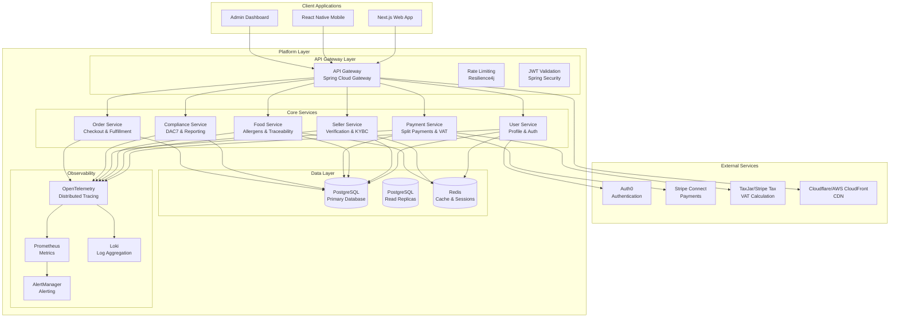
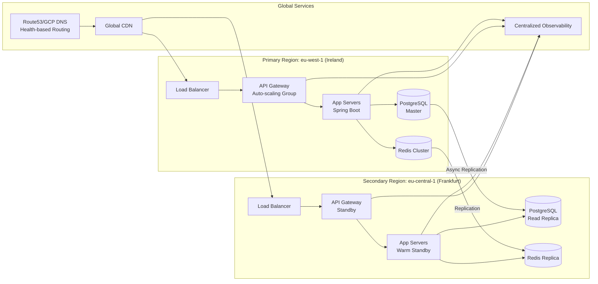

# Design Document: EUshop Enterprise Readiness Transformation

## Overview

The EUshop Enterprise Readiness Transformation transforms an early-stage artisanal food marketplace prototype into a production-ready, YC-ready platform capable of serving 100M customers while meeting all EU regulatory requirements. This design addresses 21 requirements across 5 critical pillars: Security, Compliance, Payments, Scalability, and Operations.

### Design Philosophy

**Evolutionary Architecture**: Preserve existing Spring Boot monolith strengths while incrementally adding enterprise capabilities. Avoid complete rewrites in favor of targeted enhancements that maintain backward compatibility.

**Regulatory-First Approach**: Design compliance capabilities as first-class citizens, not afterthoughts. Build validation, reporting, and audit trails into core business workflows.

**Cost-Conscious Scalability**: Implement scalable patterns that optimize for lean startup budget while preparing for investor-scale growth.

## Architecture

### System Architecture Diagram



### 5-Pillar Architecture

1. **Security Pillar**: Auth0 integration, Spring Security, secure session management, API gateway protection
2. **Compliance Pillar**: DSA Article 30 verification, DAC7 reporting, GDPR, food safety regulations
3. **Payments Pillar**: Stripe Connect split payments, VAT OSS calculation, PSD2 SCA compliance
4. **Scalability Pillar**: Read replicas, caching, CDN, event-driven architecture, auto-scaling
5. **Operations Pillar**: Multi-cloud deployment, comprehensive observability, CI/CD, cost optimization

### Deployment Architecture



## Components and Interfaces

### Core Services Design

#### 1. Authentication Service
**Responsibilities**: JWT validation, session management, user authentication flow
**Interface**: Spring Security filters, Auth0 JWKS integration
**Dependencies**: Auth0, Redis (sessions), PostgreSQL (user data)
**Key Design Decisions**:
- Use secure HTTP-only cookies for session storage
- Implement proper RS256 signature validation via Auth0 JWKS
- Remove all mock authentication pathways
- Store session state in Redis with TTL matching JWT expiry

#### 2. Seller Verification Service
**Responsibilities**: DSA Article 30 compliance, KYBC workflow, document validation
**Interface**: REST API for verification submission, webhook for status updates
**Dependencies**: PostgreSQL (verification data), document storage (S3), email service
**Key Design Decisions**:
- Asynchronous verification workflow with status tracking
- Document validation against EU business registry APIs where available
- Audit trail for all verification decisions
- Integration with compliance reporting service

#### 3. Payment Service with Split Payments
**Responsibilities**: Stripe Connect integration, split payments, VAT calculation, PSD2 SCA
**Interface**: REST API for payment intent creation, webhook handlers for payment events
**Dependencies**: Stripe Connect, TaxJar/Stripe Tax, PostgreSQL (transaction records)
**Key Design Decisions**:
- Use Stripe Connect for marketplace payment model
- Implement automatic 85/15 split with platform commission
- Integrate VAT OSS calculation using buyer location
- Support EU payment methods (SEPA, iDEAL, Sofort)

#### 4. Compliance Reporting Service
**Responsibilities**: DAC7 reporting, GDPR data management, audit trails
**Interface**: REST API for report generation, scheduled jobs for quarterly reporting
**Dependencies**: PostgreSQL (transaction data), S3 (report storage), email service
**Key Design Decisions**:
- Real-time flagging of sellers meeting DAC7 thresholds
- CSV generation per EU 2021/514 directive format
- Data retention policies aligned with GDPR requirements
- Comprehensive audit logging for all compliance actions

#### 5. Food Safety Service
**Responsibilities**: Allergen tracking, food traceability, Regulation (EU) compliance
**Interface**: REST API for allergen declaration, batch tracking, recall management
**Dependencies**: PostgreSQL (food and batch data), notification service
**Key Design Decisions**:
- Mandatory allergen selection from 14 EU-regulated allergens
- Batch-level traceability with "one step back, one step forward" tracking
- Recall workflow with 4-hour response time target
- Integration with seller verification for producer validation

### Infrastructure Components

#### 1. API Gateway
**Technology**: Spring Cloud Gateway (embedded in monolith)
**Features**: Rate limiting, circuit breaking, JWT validation, request logging
**Configuration**: YAML-based route definitions, Resilience4j for fault tolerance

#### 2. Database Layer
**Primary**: PostgreSQL 16+ with logical replication
**Scaling Strategy**: 
- Phase 1: Read replicas for scaling reads
- Phase 2: Horizontal sharding by region (EU-West, EU-Central, etc.)
- Phase 3: Tenant-based sharding for enterprise customers

#### 3. Caching Layer
**Primary**: Redis Cluster for session storage and frequent data
**Patterns**: Cache-aside pattern with TTL policies, write-through for critical data
**Monitoring**: Cache hit ratios, memory usage, eviction policies

#### 4. CDN and Edge Network
**Primary**: Cloudflare or AWS CloudFront
**Configuration**: 
- Static assets (images, CSS, JS) with long TTL
- Dynamic content with 5-minute cache invalidation
- Geo-based routing for performance optimization

### External Service Integrations

#### 1. Auth0 Integration
**Pattern**: OIDC/OAuth 2.0 with JWT tokens
**Implementation**: Spring Security OAuth2 Resource Server with JWKS validation
**Session Management**: Secure cookies with SameSite=Strict, HTTP-only flags

#### 2. Stripe Connect Integration
**Pattern**: Marketplace platform with connected accounts
**Implementation**: 
- PaymentIntent creation with transfer_data to seller accounts
- Webhook handlers for payment status updates
- Payout automation with 1099-K equivalent reporting

#### 3. Tax Calculation Integration
**Options**: Stripe Tax (preferred) or TaxJar
**Implementation**: VAT rate determination based on buyer location and product category
**Reporting**: Quarterly VAT OSS return generation

## Data Models

### Enhanced Database Schema

#### Core Tables (Existing - Enhanced)

```sql
-- Users table with compliance fields
CREATE TABLE users (
    id UUID PRIMARY KEY,
    email VARCHAR(255) UNIQUE NOT NULL,
    -- Existing fields...
    -- New compliance fields
    tax_identification_number VARCHAR(50),
    vat_number VARCHAR(50),
    business_registration_number VARCHAR(100),
    verification_status VARCHAR(20) DEFAULT 'pending',
    verification_submitted_at TIMESTAMP,
    verification_approved_at TIMESTAMP,
    verification_rejected_at TIMESTAMP,
    verification_rejection_reason TEXT,
    dac7_reporting_required BOOLEAN DEFAULT FALSE,
    dac7_threshold_met_at TIMESTAMP,
    gdpr_consent_given_at TIMESTAMP,
    data_retention_policy_acknowledged_at TIMESTAMP,
    created_at TIMESTAMP DEFAULT CURRENT_TIMESTAMP,
    updated_at TIMESTAMP DEFAULT CURRENT_TIMESTAMP
);

-- Sellers table with enhanced compliance
CREATE TABLE sellers (
    id UUID PRIMARY KEY REFERENCES users(id),
    -- Existing fields...
    -- DSA Article 30 required fields
    legal_name VARCHAR(255),
    business_address TEXT,
    business_phone VARCHAR(50),
    trade_register_id VARCHAR(100),
    -- Food safety compliance
    food_safety_certification_number VARCHAR(100),
    certification_expiry_date DATE,
    -- Audit trail
    compliance_audit_trail JSONB,
    created_at TIMESTAMP DEFAULT CURRENT_TIMESTAMP,
    updated_at TIMESTAMP DEFAULT CURRENT_TIMESTAMP
);

-- Food listings with allergen tracking
CREATE TABLE food_listings (
    id UUID PRIMARY KEY,
    seller_id UUID REFERENCES sellers(id),
    -- Existing fields...
    -- EU allergen compliance
    allergens JSONB, -- Array of allergen codes from EU regulated list
    ingredients_list TEXT,
    storage_instructions TEXT,
    country_of_origin VARCHAR(2),
    -- Traceability
    batch_identifier VARCHAR(100),
    production_date DATE,
    expiry_date DATE,
    -- Compliance flags
    allergen_disclosure_complete BOOLEAN DEFAULT FALSE,
    traceability_data_provided BOOLEAN DEFAULT FALSE,
    created_at TIMESTAMP DEFAULT CURRENT_TIMESTAMP,
    updated_at TIMESTAMP DEFAULT CURRENT_TIMESTAMP
);

-- Transactions with compliance tracking
CREATE TABLE transactions (
    id UUID PRIMARY KEY,
    buyer_id UUID REFERENCES users(id),
    seller_id UUID REFERENCES sellers(id),
    -- Payment details
    stripe_payment_intent_id VARCHAR(255),
    stripe_connect_account_id VARCHAR(255),
    amount DECIMAL(10, 2),
    platform_commission DECIMAL(10, 2),
    seller_payout DECIMAL(10, 2),
    -- VAT compliance
    vat_rate DECIMAL(5, 2),
    vat_amount DECIMAL(10, 2),
    buyer_country VARCHAR(2),
    vat_oss_reporting_period VARCHAR(10),
    -- DAC7 tracking
    included_in_dac7_report BOOLEAN DEFAULT FALSE,
    dac7_reporting_period VARCHAR(10),
    -- Audit trail
    audit_log JSONB,
    created_at TIMESTAMP DEFAULT CURRENT_TIMESTAMP
);

-- Compliance events audit table
CREATE TABLE compliance_events (
    id UUID PRIMARY KEY,
    event_type VARCHAR(50) NOT NULL,
    user_id UUID REFERENCES users(id),
    seller_id UUID REFERENCES sellers(id),
    transaction_id UUID REFERENCES transactions(id),
    event_data JSONB NOT NULL,
    ip_address INET,
    user_agent TEXT,
    created_at TIMESTAMP DEFAULT CURRENT_TIMESTAMP
);

-- Batch traceability table
CREATE TABLE food_batches (
    id UUID PRIMARY KEY,
    producer_id UUID REFERENCES sellers(id),
    food_listing_id UUID REFERENCES food_listings(id),
    batch_identifier VARCHAR(100) UNIQUE NOT NULL,
    production_date DATE NOT NULL,
    quantity INTEGER NOT NULL,
    unit VARCHAR(20),
    -- Traceability chain
    previous_batch_id UUID REFERENCES food_batches(id),
    next_batch_id UUID REFERENCES food_batches(id),
    current_holder_id UUID, -- Can be seller or buyer
    holder_type VARCHAR(20), -- 'producer', 'seller', 'buyer'
    location TEXT,
    -- Safety flags
    recall_issued BOOLEAN DEFAULT FALSE,
    recall_reason TEXT,
    recall_issued_at TIMESTAMP,
    created_at TIMESTAMP DEFAULT CURRENT_TIMESTAMP,
    updated_at TIMESTAMP DEFAULT CURRENT_TIMESTAMP
);
```

#### Indexing Strategy

```sql
-- Performance indexes
CREATE INDEX idx_users_verification_status ON users(verification_status);
CREATE INDEX idx_sellers_compliance_status ON sellers(verification_status);
CREATE INDEX idx_transactions_dac7 ON transactions(included_in_dac7_report, created_at);
CREATE INDEX idx_transactions_vat_oss ON transactions(vat_oss_reporting_period, buyer_country);
CREATE INDEX idx_food_listings_allergens ON food_listings USING gin(allergens);
CREATE INDEX idx_compliance_events_user ON compliance_events(user_id, event_type, created_at);
CREATE INDEX idx_food_batches_traceability ON food_batches(batch_identifier, producer_id);
```

### Data Migration Strategy

**Phase 1: Schema Evolution**
1. Add nullable compliance columns to existing tables
2. Backfill data where possible from existing records
3. Apply NOT NULL constraints after data migration

**Phase 2: Data Enrichment**
1. Require compliance data for new sellers during onboarding
2. Gradually request existing sellers to provide missing compliance data
3. Implement grace periods with clear communication

**Phase 3: Validation Enforcement**
1. Enforce complete compliance data before critical actions (payouts, new listings)
2. Implement progressive enforcement based on business risk

## Correctness Properties

*A property is a characteristic or behavior that should hold true across all valid executions of a system-essentially, a formal statement about what the system should do. Properties serve as the bridge between human-readable specifications and machine-verifiable correctness guarantees.*

### PBT Applicability Assessment

After analyzing all 115 acceptance criteria across 21 requirements, property-based testing is appropriate for specific pure-function components but not for the entire enterprise transformation. The following categorization guides testing strategy:

**Property-Based Testing (PBT) Areas** (24 criteria):
- Business logic with meaningful input variation (calculations, validations, transformations)
- Core algorithms that benefit from randomized input testing
- Data transformation logic with consistent format requirements

**Example-Based Testing Areas** (25 criteria):
- Specific scenarios with concrete expected outcomes
- Configuration validation that is binary (works/doesn't work)
- Integration points with external services

**Integration Testing Areas** (8 criteria):
- External service interactions (Stripe, Auth0, tax services)
- Cross-system workflows requiring end-to-end validation
- Message queue and event processing

**Smoke/Configuration Testing Areas** (58 criteria):
- Infrastructure as Code (Terraform) validation
- Security and compliance configuration
- Monitoring, alerting, and observability setup
- Deployment pipeline configuration

### Property Reflection and Consolidation

After analyzing all testable criteria, the following core properties have been identified and consolidated to eliminate redundancy:

#### Core Business Logic Properties

##### Property 1: Authorization and Access Control Consistency
*For any* user with a specific role and any protected resource or action, the authorization system shall grant or deny access consistently based on the user's verified role permissions, without regard to other user attributes.

**Validates: Requirements 1.4** (Role-based access control enforcement)

##### Property 2: Rate Limiting and Abuse Detection
*For any* sequence of API requests from a given IP address or user ID, the rate limiting system shall consistently apply configured limits, and the abuse detection system shall trigger circuit breakers when patterns indicate potential abuse.

**Validates: Requirements 2.2, 2.3** (Rate limiting per IP/user, abuse pattern detection)

##### Property 3: Business Rule Enforcement Based on Verification Status
*For any* seller with a given verification status (pending, approved, rejected), the platform shall consistently enforce business rules regarding product listing, payment receipt, and other restricted actions based solely on that status.

**Validates: Requirements 3.2, 3.3** (Prevent actions while pending, reject incomplete applications)

##### Property 4: Audit Trail Completeness and Consistency
*For any* system action that modifies sensitive data (user info, compliance status, financial transactions) or accesses protected resources, a complete audit trail shall be generated containing actor identity, timestamp, action type, and before/after state where applicable.

**Validates: Requirements 3.5, 5.4** (Verification audit trail, data access audit trail)

#### Compliance and Regulatory Properties

##### Property 5: DAC7 Threshold Detection and Reporting
*For any* seller and any set of their transactions within a calendar year, the system shall correctly detect when the seller exceeds €2,000 in revenue or 30+ transactions, and shall consistently include such sellers in DAC7 report preparations with all required transaction details.

**Validates: Requirements 4.2, 4.3, 4.4** (Threshold detection, report inclusion, CSV format)

##### Property 6: Tax ID Validation by Country
*For any* tax identification number and associated country code, the validation function shall correctly determine whether the format matches the expected pattern for that country's tax ID system.

**Validates: Requirements 4.5** (Tax ID format validation)

##### Property 7: GDPR Data Portability Export Completeness
*For any* user's personal data stored across all system tables, the data portability export function shall produce a structured, machine-readable JSON document containing all data subject to GDPR Article 20 rights, without omission, alteration, or inclusion of non-personal data.

**Validates: Requirements 5.5** (Data portability exports)

##### Property 8: Platform Commission and Fund Distribution
*For any* valid transaction amount (item price + shipping), the commission calculation shall always compute platform commission as exactly 15%, and the resulting fund distribution shall satisfy: seller_amount + platform_commission = original_amount, with seller_amount = 85% of original_amount.

**Validates: Requirements 6.2, 6.3** (15% commission calculation, 85/15 fund distribution)

##### Property 9: VAT Rate Determination and Liability Calculation
*For any* combination of buyer location (EU member state), product category, and platform supplier status, the VAT calculation shall: (1) determine the correct VAT rate per EU directives, (2) calculate VAT amount correctly, and (3) when platform is deemed supplier, correctly compute and record VAT liability.

**Validates: Requirements 7.1, 7.2, 7.3** (Location determination, rate application, liability calculation)

##### Property 10: VAT OSS Report Generation Consistency
*For any* set of cross-border EU transactions within a quarterly period, the VAT OSS report generation function shall produce data in the format required by EU OSS regulations, with all required fields populated and transaction-level detail preserved.

**Validates: Requirements 7.4** (OSS report generation)

##### Property 11: EU Allergen Regulation Compliance
*For any* food listing with specified ingredients, the system shall: (1) correctly identify all EU-regulated allergens from Regulation 1169/2011 Annex II present in the ingredients, (2) prevent publication if allergen disclosure is incomplete, and (3) display ingredients with allergen highlighting where provided.

**Validates: Requirements 14.3, 14.4, 14.5** (Allergen validation, publication prevention, display formatting)

##### Property 12: Food Traceability Chain Integrity
*For any* sequence of food batch transfers through the supply chain, the traceability system shall maintain the "one step back, one step forward" property: each batch record correctly references its immediate previous holder and immediate next holder (when known), creating an unbroken chain from producer to consumer.

**Validates: Requirements 15.2** (Transfer tracking in supply chain)

#### Business and Operational Properties

##### Property 13: Business Metrics Calculation Accuracy
*For any* set of platform activity data within a given time period, the metrics calculation shall correctly compute: Gross Merchandise Value (sum of transaction amounts), active user count (distinct users with activity), seller count (verified sellers with listings), and conversion funnel metrics (visit-to-purchase ratios).

**Validates: Requirements 19.1, 19.2** (Daily metrics, conversion funnel tracking)

##### Property 14: Cohort Analysis Segmentation
*For any* set of users with acquisition dates, geographic regions, and behavior patterns, the cohort analysis function shall correctly segment users by: acquisition cohort (e.g., monthly cohorts), geographic region, and behavior-based segments (e.g., high-value, occasional, inactive).

**Validates: Requirements 19.6** (User segmentation for cohort analysis)

##### Property 15: Cost Optimization Analysis
*For any* set of resource utilization metrics over time, the cost optimization analysis shall correctly identify underutilized resources and provide right-sizing recommendations that maintain performance requirements while reducing costs.

**Validates: Requirements 18.1** (Resource utilization analysis)

##### Property 16: Cost Allocation Reporting Consistency
*For any* set of infrastructure and operational costs, the cost allocation reporting shall consistently assign costs to the correct teams, features, and environments based on configured allocation rules, producing reports with consistent formatting and granularity.

**Validates: Requirements 18.5** (Granular cost allocation)

#### Infrastructure and API Properties

##### Property 17: OpenAPI Specification Generation
*For any* set of REST API endpoints with their request/response schemas, authentication requirements, and documentation, the OpenAPI specification generation shall produce a valid OpenAPI 3.0 document that accurately describes all endpoints, parameters, responses, and security schemes.

**Validates: Requirements 17.1** (Comprehensive REST API with OpenAPI spec)

##### Property 18: Investor Documentation Package Completeness
*For any* current state of the business (team composition, traction metrics, technology stack, market position, financials, compliance status), the investor documentation generation shall produce a complete package containing all required components with consistent formatting and organization.

**Validates: Requirements 20.4, 20.5** (Financial model generation, data room organization)

### Property Implementation Strategy

Each property shall be implemented as a jqwik property test in the corresponding service module:

1. **Test Configuration**: Minimum 100 iterations per property test
2. **Generator Design**: Custom generators for domain-specific data (EU countries, food categories, tax IDs, etc.)
3. **Assertion Strategy**: Combination of direct assertions and metamorphic testing
4. **Shrinking Support**: Custom shrinkers for domain types to produce minimal failing examples
5. **Tagging**: Each test tagged with `@Feature("eushop-enterprise-readiness")` and `@Property("X")` where X is the property number

**Example Property Test Structure**:
```java
@Property
@Feature("eushop-enterprise-readiness")
@Property("8") // Platform commission calculation
void platformCommissionCalculation(
    @ForAll @Positive BigDecimal itemPrice,
    @ForAll @NonNegative BigDecimal shippingCost) {
    
    BigDecimal total = itemPrice.add(shippingCost);
    BigDecimal commission = paymentService.calculateCommission(total);
    BigDecimal sellerAmount = paymentService.calculateSellerAmount(total);
    
    // Property: commission is exactly 15%
    assertThat(commission)
        .isEqualByComparingTo(total.multiply(new BigDecimal("0.15")));
    
    // Property: total = commission + seller amount
    assertThat(total)
        .isEqualByComparingTo(commission.add(sellerAmount));
    
    // Property: seller gets exactly 85%
    assertThat(sellerAmount)
        .isEqualByComparingTo(total.multiply(new BigDecimal("0.85")));
}
```

## Error Handling

### Error Classification

#### 1. Compliance Validation Errors (HTTP 400)
- Missing required compliance data
- Invalid tax identification numbers
- Incomplete allergen disclosures
- Expired food safety certifications

**Handling Strategy**: Detailed error messages with guidance for correction, persistence of partial progress where possible.

#### 2. Payment Processing Errors (HTTP 402/409)
- Insufficient funds
- Payment method declined
- PSD2 SCA requirements not met
- Currency conversion issues

**Handling Strategy**: Retry logic with exponential backoff, user notification with actionable steps, fallback payment methods.

#### 3. Security and Authentication Errors (HTTP 401/403)
- Invalid or expired JWT tokens
- Insufficient permissions for requested action
- Rate limit exceeded
- Suspicious activity patterns

**Handling Strategy**: Immediate rejection with security logging, potential account lockdown for repeated violations.

#### 4. External Service Errors (HTTP 502/503)
- Auth0 authentication service unavailable
- Stripe payment processing downtime
- Tax calculation service timeout
- Database connection failures

**Handling Strategy**: Circuit breaker pattern, graceful degradation, cached responses where safe, user-friendly error pages.

#### 5. Business Logic Errors (HTTP 422)
- Invalid business state transitions
- Constraint violations (e.g., selling expired food)
- Compliance rule violations
- Geographic restrictions

**Handling Strategy**: Clear business error messages, suggestion of alternative actions, audit logging.

### Retry and Recovery Strategies

#### Payment Processing Retry
```java
@Retryable(value = {StripeException.class}, 
           maxAttempts = 3,
           backoff = @Backoff(delay = 1000, multiplier = 2))
public PaymentResult processPayment(PaymentRequest request) {
    // Payment processing logic
}
```

#### External Service Circuit Breaker
```java
@CircuitBreaker(name = "taxService", 
                fallbackMethod = "calculateTaxFallback",
                failureRateThreshold = 50,
                waitDurationInOpenState = 30000)
public TaxResult calculateTax(TaxRequest request) {
    // Tax calculation logic
}
```

### Audit Trail for Errors

All errors are logged with:
- Unique error ID for user reference
- Timestamp and service instance identifier
- User context (if authenticated)
- Request details (endpoint, parameters)
- Stack trace for debugging
- Error classification and severity

## Testing Strategy

### Quadruple Testing Approach

Based on the prework analysis of 115 acceptance criteria across 21 requirements, a four-pronged testing strategy is required:

#### 1. Property-Based Tests for Core Business Logic (24 criteria)
- **Framework**: jqwik for Java property-based testing
- **Coverage Target**: 100% of identified property-testable criteria
- **Property Tests**: Minimum 100 iterations per property test
- **Focus Areas**: 
  - Authorization and access control (Property 1)
  - Rate limiting and abuse detection (Property 2)
  - Business rule enforcement (Property 3)
  - Audit trail generation (Property 4)
  - DAC7 threshold detection and reporting (Property 5)
  - Tax ID validation (Property 6)
  - GDPR data portability (Property 7)
  - Platform commission calculations (Property 8)
  - VAT rate determination (Property 9)
  - VAT OSS reporting (Property 10)
  - Allergen regulation compliance (Property 11)
  - Food traceability chain integrity (Property 12)
  - Business metrics calculation (Property 13)
  - Cohort analysis segmentation (Property 14)
  - Cost optimization analysis (Property 15)
  - Cost allocation reporting (Property 16)
  - OpenAPI specification generation (Property 17)
  - Investor documentation generation (Property 18)

#### 2. Example-Based Unit Tests (25 criteria)
- **Framework**: JUnit 5 with Mockito
- **Coverage Target**: 100% of example-testable criteria
- **Focus Areas**:
  - Specific authentication scenarios (JWT validation, cookie configuration)
  - Error response formats (401 Unauthorized, validation errors)
  - Configuration validation (required fields, format checks)
  - Legal document presentation (ToS, Privacy Policy acceptance)
  - Specific business scenarios (admin bypass rejection, cache invalidation timing)

#### 3. Integration Tests for External Services (8 criteria)
- **Framework**: Spring Boot Test with Testcontainers and WireMock
- **Scope**: External service interactions and cross-system workflows
- **External Service Mocks**:
  - WireMock for Auth0 authentication flows
  - WireMock for Stripe Connect payment processing
  - WireMock for tax calculation services (TaxJar/Stripe Tax)
  - Testcontainers for message queue testing
  - Mock services for cross-cloud database replication
  - Mock services for CDN analytics integration
- **Database**: Testcontainers PostgreSQL with Flyway migrations
- **Cache**: Testcontainers Redis for session and cache testing

#### 4. Smoke and Configuration Tests (58 criteria)
- **Infrastructure Tests**:
  - Terraform validation (`terraform validate`, `terraform plan`)
  - Cloud-specific configuration validation
  - Security configuration checks (TLS termination, mTLS, network isolation)
  - Monitoring and observability setup (APM, distributed tracing, alerting)
- **Security Scans**:
  - OWASP Dependency Check for vulnerability scanning
  - Snyk/Trivy for container image scanning
  - SAST tools for static code analysis
- **Compliance Checks**:
  - Policy-as-Code with Open Policy Agent (OPA)
  - GDPR compliance configuration validation
  - Data retention policy enforcement checks
- **Deployment Pipeline Tests**:
  - CI/CD configuration validation
  - Canary deployment configuration testing
  - Blue-green deployment rollback testing
  - Post-deployment verification test execution

#### 5. End-to-End Tests
- **Framework**: Playwright for web application testing
- **Scope**: Critical user journeys spanning multiple services
- **Test Scenarios**:
  - Complete seller onboarding with DSA Article 30 verification
  - End-to-end purchase flow with Stripe payment and VAT calculation
  - Food listing creation with allergen disclosure and traceability
  - Compliance report generation and download
  - GDPR data portability request and export
- **Environment**: Staging environment with production-like configuration
- **Data**: Test data generation covering edge cases and compliance scenarios

### Test Environment Strategy

#### Local Development Environment
- **Containers**: Docker Compose with PostgreSQL 16, Redis 8, WireMock
- **External Service Mocks**: WireMock instances configured for Auth0, Stripe Connect, TaxJar/Stripe Tax
- **Property Tests**: jqwik property tests for all 18 core business logic properties
- **Database Testing**: Testcontainers PostgreSQL for integration tests with Flyway migrations
- **Cache Testing**: Testcontainers Redis for session management and cache behavior validation
- **Message Queue**: Testcontainers for event-driven architecture testing
- **Monitoring**: Local Prometheus, Grafana, and OpenTelemetry Collector for observability testing

#### CI/CD Pipeline Testing Stages

1. **Property Test Stage**: Core business logic validation (<10 minutes)
   - jqwik property tests for all 18 identified properties
   - Minimum 100 iterations per property with custom generators
   - Shrinking support for minimal counterexamples
   - Code coverage reporting focused on property-tested code paths
   - Test tagging: `@Feature("eushop-enterprise-readiness") @Property("X")`

2. **Unit Test Stage**: Example-based scenario validation (<10 minutes)
   - JUnit 5 tests for 25 example-testable criteria
   - Mockito for external dependency isolation
   - Configuration validation tests (security, compliance, business rules)
   - Error scenario and edge case testing
   - Integration with JaCoCo for code coverage reporting

3. **Integration Test Stage**: External service validation (<20 minutes)
   - Testcontainers with production-like PostgreSQL configuration
   - WireMock for all 8 external service integration criteria
   - Redis cache behavior and session management testing
   - Message queue integration testing for event-driven patterns
   - Database migration testing with Flyway
   - Cross-service communication validation

4. **Security Scan Stage**: Comprehensive security validation (<15 minutes)
   - OWASP Dependency Check for Java dependencies
   - Trivy for container image vulnerability scanning
   - Secret detection scanning for credentials in code
   - SAST (Static Application Security Testing) tools
   - Infrastructure security configuration validation
   - Compliance with security best practices and standards

5. **Infrastructure Test Stage**: IaC and configuration validation (<15 minutes)
   - Terraform validation (`terraform validate`, `terraform fmt`)
   - Terraform plan review for infrastructure changes
   - Open Policy Agent (OPA) for policy-as-code compliance checks
   - Cost estimation validation for infrastructure changes
   - Security configuration validation (TLS, mTLS, network policies)
   - Multi-cloud deployment configuration testing

6. **Smoke Test Stage**: Production configuration validation (<10 minutes)
   - Deployment configuration validation across environments
   - Monitoring and observability setup verification
   - Alerting configuration and notification channel testing
   - Compliance configuration checks (GDPR, DSA, DAC7)
   - Data retention policy configuration validation
   - Backup and disaster recovery configuration testing

7. **E2E Test Stage**: User journey and compliance workflow validation (<30 minutes)
   - Playwright tests against staging environment
   - Critical user journey testing (signup → verification → listing → purchase)
   - Compliance workflow testing (DSA Article 30 verification, DAC7 reporting)
   - GDPR compliance testing (data portability, right to erasure)
   - Food safety regulation testing (allergen disclosure, traceability)
   - Performance baseline testing for critical paths
   - Cross-browser and cross-device compatibility testing

#### Test Data Management Strategy

1. **Property Test Data Generation**:
   - Custom jqwik generators for domain types (EU countries, tax IDs, food categories)
   - Edge case generation for boundary conditions
   - Realistic data generation based on production patterns
   - Anonymized production data sampling for realistic test scenarios

2. **Integration Test Data**:
   - Testcontainers database with pre-seeded compliance data
   - WireMock scenarios for external service responses
   - Compliance test data covering GDPR, DSA, DAC7 requirements
   - Food safety test data with allergen combinations and traceability chains

3. **E2E Test Data**:
   - Staging environment with production-like data volume
   - Anonymized customer data for realistic testing
   - Compliance scenario test data (threshold cases, edge conditions)
   - Performance test data simulating peak traffic patterns

### Property Test Implementation Examples

#### Example 1: Platform Commission Calculation (Property 8)
```java
@Property
@Feature("eushop-enterprise-readiness")
@Property("8")
void platformCommissionCalculation(
    @ForAll @Positive BigDecimal itemPrice,
    @ForAll @NonNegative BigDecimal shippingCost) {
    
    BigDecimal total = itemPrice.add(shippingCost);
    BigDecimal commission = paymentService.calculateCommission(total);
    BigDecimal sellerAmount = paymentService.calculateSellerAmount(total);
    
    // Property: commission is exactly 15%
    assertThat(commission)
        .isEqualByComparingTo(total.multiply(new BigDecimal("0.15")));
    
    // Property: total = commission + seller amount
    assertThat(total)
        .isEqualByComparingTo(commission.add(sellerAmount));
    
    // Property: seller gets exactly 85%
    assertThat(sellerAmount)
        .isEqualByComparingTo(total.multiply(new BigDecimal("0.85")));
}
```

#### Example 2: DAC7 Threshold Detection (Property 5)
```java
@Property
@Feature("eushop-enterprise-readiness")
@Property("5")
void dac7ThresholdDetection(
    @ForAll List<@Size(min=1, max=50) Transaction> transactions,
    @ForAll Year year) {
    
    List<Transaction> yearTransactions = transactions.stream()
        .filter(t -> t.getYear() == year.getValue())
        .collect(Collectors.toList());
    
    BigDecimal totalRevenue = yearTransactions.stream()
        .map(Transaction::getAmount)
        .reduce(BigDecimal.ZERO, BigDecimal::add);
    
    boolean exceedsRevenueThreshold = totalRevenue.compareTo(new BigDecimal("2000")) > 0;
    boolean exceedsTransactionThreshold = yearTransactions.size() > 30;
    boolean shouldReport = exceedsRevenueThreshold || exceedsTransactionThreshold;
    
    boolean systemDetects = complianceService.shouldIncludeInDac7Report(
        yearTransactions, year.getValue());
    
    // Property: system detection matches manual calculation
    assertThat(systemDetects).isEqualTo(shouldReport);
}
```

#### Example 3: VAT Rate Determination (Property 9)
```java
@Property
@Feature("eushop-enterprise-readiness")
@Property("9")
void vatRateDetermination(
    @ForAll("euCountryCodes") String countryCode,
    @ForAll("foodCategories") String category,
    @ForAll boolean platformIsSupplier) {
    
    VatCalculationResult result = vatService.calculateVat(
        countryCode, category, platformIsSupplier);
    
    // Property: rate is within EU VAT range (0-27%)
    assertThat(result.getRate())
        .isBetween(BigDecimal.ZERO, new BigDecimal("0.27"));
    
    // Property: liability is correctly calculated when platform is supplier
    if (platformIsSupplier) {
        assertThat(result.getLiability()).isNotNull();
        assertThat(result.getLiability())
            .isEqualByComparingTo(result.getAmount().multiply(result.getRate()));
    } else {
        assertThat(result.getLiability()).isNull();
    }
}

@Provide
Arbitrary<String> euCountryCodes() {
    return Arbitraries.of("AT", "BE", "BG", "CY", "CZ", "DE", "DK", "EE", 
                         "ES", "FI", "FR", "GR", "HR", "HU", "IE", "IT", 
                         "LT", "LU", "LV", "MT", "NL", "PL", "PT", "RO", 
                         "SE", "SI", "SK");
}

@Provide
Arbitrary<String> foodCategories() {
    return Arbitraries.of("standard", "reduced", "zero", "exempt", 
                         "special_rate", "super_reduced");
}
```

### Testing SLOs and Metrics

1. **Test Execution Time**: <90 minutes for full test suite across all test types
2. **Test Reliability**: <1% flaky test rate across property, unit, integration, and smoke tests
3. **Code Coverage Targets**:
   - Property-tested business logic: >95% line coverage
   - Example-tested scenarios: >90% line coverage  
   - Integration-tested services: >85% line coverage
   - Overall critical path services: >80% line coverage
4. **Property Test Configuration**: 100+ iterations per property with shrinking support
5. **Integration Test Coverage**: All 8 external service interaction criteria mocked and tested
6. **Security Scan Coverage**: 100% of dependencies, container images, and infrastructure code
7. **Compliance Test Coverage**: All GDPR, DSA Article 30, DAC7, and food safety regulation requirements

### Compliance Testing

#### DSA Article 30 Verification Tests
- Test seller verification workflow end-to-end
- Validate document collection and storage
- Test audit trail generation
- Verify rejection scenarios with proper messaging

#### DAC7 Reporting Tests
- Test threshold detection logic
- Validate CSV export format compliance
- Test data accuracy in generated reports
- Verify encryption and secure delivery

#### GDPR Compliance Tests
- Test data portability exports
- Validate right to erasure implementation
- Test consent management workflows
- Verify audit trail completeness

#### Food Safety Regulation Tests
- Test allergen disclosure enforcement
- Validate traceability chain integrity
- Test recall workflow efficiency
- Verify compliance with EU Regulation 1169/2011

## Evolutionary Implementation Strategy

### Phase 1: Security and Compliance Foundation (Months 1-2)

#### Week 1-2: Authentication Overhaul
1. **Current State**: Mock authentication with localStorage
2. **Target State**: Auth0 integration with Spring Security
3. **Implementation**:
   - Add Spring Security OAuth2 Resource Server configuration
   - Implement Auth0 JWKS validation
   - Replace localStorage tokens with secure HTTP-only cookies
   - Add rate limiting and security headers
4. **Preservation**: Maintain existing API contracts for frontend compatibility

#### Week 3-4: Database Schema Evolution
1. **Current State**: Basic user and food tables
2. **Target State**: Compliance fields added to existing tables
3. **Implementation**:
   - Add nullable compliance columns using Flyway migrations
   - Create new compliance-specific tables (audit trails, batch tracking)
   - Implement data validation services
4. **Preservation**: All existing data remains accessible, new fields optional initially

#### Week 5-6: Seller Verification Workflow
1. **Current State**: Basic seller registration
2. **Target State**: DSA Article 30 compliant verification
3. **Implementation**:
   - Enhanced seller onboarding with compliance data collection
   - Document upload and validation
   - Verification status tracking
   - Email notifications for status changes
4. **Preservation**: Existing sellers grandfathered with grace period

#### Week 7-8: Legal Framework Implementation
1. **Current State**: Basic terms of service
2. **Target State**: Comprehensive legal framework
3. **Implementation**:
   - GDPR-compliant privacy policy
   - Cookie consent management
   - Data processing agreements
   - Terms of service updates
4. **Preservation**: Existing users prompted to accept new terms on next login

### Phase 2: Payment and Scalability (Months 3-4)

#### Month 3: Payment Integration
1. **Current State**: Mock payment processing
2. **Target State**: Stripe Connect with split payments
3. **Implementation**:
   - Stripe Connect account creation for sellers
   - PaymentIntent creation with platform commission
   - VAT OSS calculation integration
   - PSD2 SCA implementation
4. **Preservation**: Maintain existing checkout flow with enhanced payment options

#### Month 4: Basic Scalability Patterns
1. **Current State**: Single database instance
2. **Target State**: Read replicas and caching
3. **Implementation**:
   - PostgreSQL read replica configuration
   - Redis caching for frequent data
   - Connection pooling optimization
   - Basic monitoring setup
4. **Preservation**: Application code remains largely unchanged, configuration-driven scaling

### Phase 3: Advanced Operations (Months 5-6)

#### Month 5: Comprehensive Observability
1. **Current State**: Basic logging
2. **Target State**: Full APM with distributed tracing
3. **Implementation**:
   - OpenTelemetry instrumentation
   - Prometheus metrics collection
   - Grafana dashboards
   - AlertManager configuration
4. **Preservation**: Add observability as additive feature, not breaking changes

#### Month 6: CI/CD and Testing
1. **Current State**: Manual deployment
2. **Target State**: Automated CI/CD pipeline
3. **Implementation**:
   - GitHub Actions workflow
   - Terraform infrastructure as code
   - Canary deployment strategy
   - Comprehensive test suite
4. **Preservation**: Maintain ability for manual deployment during transition

### Phase 4: Growth and Optimization (Months 7-12)

#### Months 7-8: Multi-Region Deployment
1. **Current State**: Single region deployment
2. **Target State**: Multi-region with failover
3. **Implementation**:
   - Second region deployment
   - Database replication across regions
   - Global load balancing
   - Data residency compliance
4. **Preservation**: Gradual rollout with canary testing

#### Months 9-10: Enterprise Features
1. **Current State**: Consumer-focused features
2. **Target State**: Enterprise APIs and capabilities
3. **Implementation**:
   - REST API with OpenAPI documentation
   - Webhook integrations
   - White-label capabilities
   - Bulk operations
4. **Preservation**: Maintain existing consumer experience while adding enterprise features

#### Months 11-12: Cost Optimization and Analytics
1. **Current State**: Basic cost tracking
2. **Target State**: Comprehensive cost optimization
3. **Implementation**:
   - Cost allocation by team/feature
   - Autoscaling optimization
   - Reserved instance utilization
   - Business intelligence dashboards
4. **Preservation**: Optimize existing infrastructure without service disruption

## Risk Mitigation

### Technical Risks

#### Risk 1: Spring Boot Monolith Complexity
**Mitigation**: 
- Strict package organization by domain
- Spring Application Events for decoupling
- Regular dependency audits
- Modular testing strategy

#### Risk 2: Database Migration Complexity
**Mitigation**:
- Incremental schema changes
- Comprehensive backup strategy
- Dry-run migrations in staging
- Rollback procedures for each migration

#### Risk 3: External Service Dependencies
**Mitigation**:
- Circuit breaker patterns
- Graceful degradation
- Mock services for development
- Contract testing with providers

### Compliance Risks

#### Risk 4: Regulatory Change Management
**Mitigation**:
- Regular monitoring of EU regulatory updates
- Flexible configuration for compliance rules
- Legal counsel review process
- Compliance testing suite

#### Risk 5: Cross-Border Legal Complexity
**Mitigation**:
- Country-specific legal review
- Flexible terms of service by jurisdiction
- Clear jurisdiction clauses
- Local legal counsel for key markets

### Operational Risks

#### Risk 6: Team Scaling During Transformation
**Mitigation**:
- Comprehensive documentation
- Clear architectural decisions
- Standardized development practices
- Knowledge sharing sessions

#### Risk 7: Budget Constraints
**Mitigation**:
- Cost monitoring from day one
- Reserved instances for predictable workloads
- Gradual scaling based on actual usage
- Regular cost optimization reviews

## Success Metrics

### Security Metrics
- Zero critical vulnerabilities in penetration tests
- 100% removal of mock authentication pathways
- Successful third-party security audit completion
- ISO 27001 certification readiness within 12 months

### Compliance Metrics
- Successful DSA Article 30 audit completion
- Accurate DAC7 reporting filed with all required authorities
- Zero GDPR violations or sanctions
- Full compliance with EU food safety regulations

### Performance Metrics
- 99.9% platform availability SLO
- <200ms API response time p95
- Database query performance maintained during scaling
- CDN cache hit ratio >90%

### Business Metrics
- <1% payment failure rate
- <24 hour seller payout processing
- <5% deployment failure rate
- 30% reduction in cost per transaction through optimization

### Development Metrics
- Deployment frequency: Multiple times per day
- Change failure rate: <5%
- Mean time to recovery: <30 minutes for P1 incidents
- Test suite execution: <30 minutes

## Conclusion

This design provides a comprehensive roadmap for transforming EUshop from prototype to production-ready enterprise platform. The evolutionary approach ensures preservation of existing codebase strengths while systematically addressing critical gaps in security, compliance, scalability, payments, and operations.

The design balances immediate business needs with long-term scalability, regulatory requirements with developer productivity, and technical excellence with cost consciousness. By following this phased implementation strategy, EUshop can achieve YC readiness within 6 months while building a foundation capable of scaling to 100M customers.

Each phase delivers incremental value while maintaining backward compatibility, allowing the platform to continue serving existing customers throughout the transformation. The quadruple testing approach (property-based for 18 core business logic properties, example-based for 25 specific scenarios, integration for 8 external services, and smoke/configuration tests for 58 infrastructure criteria) ensures comprehensive correctness, reliability, and compliance as the system evolves.

This design represents not just a technical transformation, but a strategic repositioning of EUshop as a compliant, scalable, and investment-ready platform ready to capture the European artisanal food market.