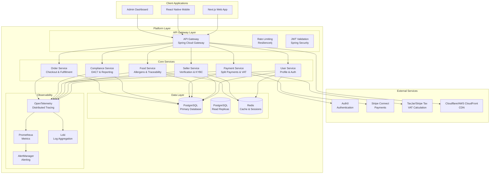
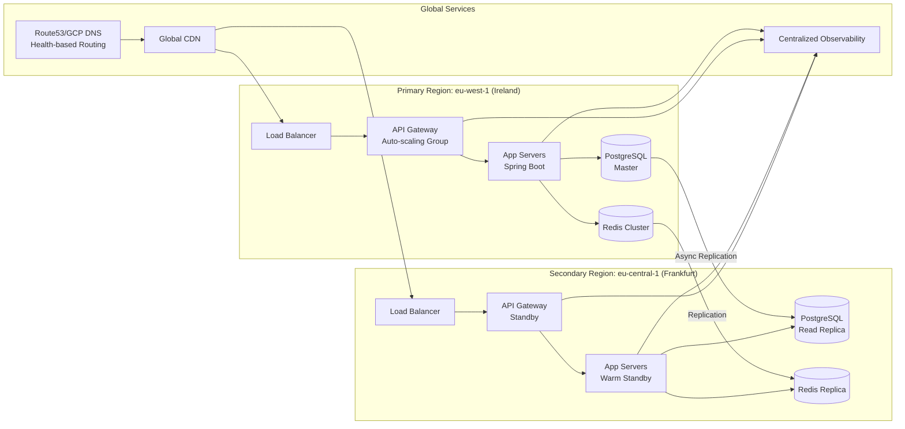

# Design Document: EUshop Enterprise Readiness Transformation

## Overview

The EUshop Enterprise Readiness Transformation transforms an early-stage artisanal food marketplace prototype into a production-ready, YC-ready platform capable of serving 100M customers while meeting all EU regulatory requirements. This design addresses 21 requirements across 5 critical pillars: Security, Compliance, Payments, Scalability, and Operations.

### Design Philosophy

**Evolutionary Architecture**: Preserve existing Spring Boot monolith strengths while incrementally adding enterprise capabilities. Avoid complete rewrites in favor of targeted enhancements that maintain backward compatibility.

**Regulatory-First Approach**: Design compliance capabilities as first-class citizens, not afterthoughts. Build validation, reporting, and audit trails into core business workflows.

**Cost-Conscious Scalability**: Implement scalable patterns that optimize for lean startup budget while preparing for investor-scale growth.

## Architecture

### System Architecture Diagram



### 5-Pillar Architecture

1. **Security Pillar**: Auth0 integration, Spring Security, secure session management, API gateway protection
2. **Compliance Pillar**: DSA Article 30 verification, DAC7 reporting, GDPR, food safety regulations
3. **Payments Pillar**: Stripe Connect split payments, VAT OSS calculation, PSD2 SCA compliance
4. **Scalability Pillar**: Read replicas, caching, CDN, event-driven architecture, auto-scaling
5. **Operations Pillar**: Multi-cloud deployment, comprehensive observability, CI/CD, cost optimization

### Deployment Architecture



## Components and Interfaces

### Core Services Design

#### 1. Authentication Service
**Responsibilities**: JWT validation, session management, user authentication flow
**Interface**: Spring Security filters, Auth0 JWKS integration
**Dependencies**: Auth0, Redis (sessions), PostgreSQL (user data)
**Key Design Decisions**:
- Use secure HTTP-only cookies for session storage
- Implement proper RS256 signature validation via Auth0 JWKS
- Remove all mock authentication pathways
- Store session state in Redis with TTL matching JWT expiry

#### 2. Seller Verification Service
**Responsibilities**: DSA Article 30 compliance, KYBC workflow, document validation
**Interface**: REST API for verification submission, webhook for status updates
**Dependencies**: PostgreSQL (verification data), document storage (S3), email service
**Key Design Decisions**:
- Asynchronous verification workflow with status tracking
- Document validation against EU business registry APIs where available
- Audit trail for all verification decisions
- Integration with compliance reporting service

#### 3. Payment Service with Split Payments
**Responsibilities**: Stripe Connect integration, split payments, VAT calculation, PSD2 SCA
**Interface**: REST API for payment intent creation, webhook handlers for payment events
**Dependencies**: Stripe Connect, TaxJar/Stripe Tax, PostgreSQL (transaction records)
**Key Design Decisions**:
- Use Stripe Connect for marketplace payment model
- Implement automatic 85/15 split with platform commission
- Integrate VAT OSS calculation using buyer location
- Support EU payment methods (SEPA, iDEAL, Sofort)

#### 4. Compliance Reporting Service
**Responsibilities**: DAC7 reporting, GDPR data management, audit trails
**Interface**: REST API for report generation, scheduled jobs for quarterly reporting
**Dependencies**: PostgreSQL (transaction data), S3 (report storage), email service
**Key Design Decisions**:
- Real-time flagging of sellers meeting DAC7 thresholds
- CSV generation per EU 2021/514 directive format
- Data retention policies aligned with GDPR requirements
- Comprehensive audit logging for all compliance actions

#### 5. Food Safety Service
**Responsibilities**: Allergen tracking, food traceability, Regulation (EU) compliance
**Interface**: REST API for allergen declaration, batch tracking, recall management
**Dependencies**: PostgreSQL (food and batch data), notification service
**Key Design Decisions**:
- Mandatory allergen selection from 14 EU-regulated allergens
- Batch-level traceability with "one step back, one step forward" tracking
- Recall workflow with 4-hour response time target
- Integration with seller verification for producer validation

### Infrastructure Components

#### 1. API Gateway
**Technology**: Spring Cloud Gateway (embedded in monolith)
**Features**: Rate limiting, circuit breaking, JWT validation, request logging
**Configuration**: YAML-based route definitions, Resilience4j for fault tolerance

#### 2. Database Layer
**Primary**: PostgreSQL 16+ with logical replication
**Scaling Strategy**: 
- Phase 1: Read replicas for scaling reads
- Phase 2: Horizontal sharding by region (EU-West, EU-Central, etc.)
- Phase 3: Tenant-based sharding for enterprise customers

#### 3. Caching Layer
**Primary**: Redis Cluster for session storage and frequent data
**Patterns**: Cache-aside pattern with TTL policies, write-through for critical data
**Monitoring**: Cache hit ratios, memory usage, eviction policies

#### 4. CDN and Edge Network
**Primary**: Cloudflare or AWS CloudFront
**Configuration**: 
- Static assets (images, CSS, JS) with long TTL
- Dynamic content with 5-minute cache invalidation
- Geo-based routing for performance optimization

### External Service Integrations

#### 1. Auth0 Integration
**Pattern**: OIDC/OAuth 2.0 with JWT tokens
**Implementation**: Spring Security OAuth2 Resource Server with JWKS validation
**Session Management**: Secure cookies with SameSite=Strict, HTTP-only flags

#### 2. Stripe Connect Integration
**Pattern**: Marketplace platform with connected accounts
**Implementation**: 
- PaymentIntent creation with transfer_data to seller accounts
- Webhook handlers for payment status updates
- Payout automation with 1099-K equivalent reporting

#### 3. Tax Calculation Integration
**Options**: Stripe Tax (preferred) or TaxJar
**Implementation**: VAT rate determination based on buyer location and product category
**Reporting**: Quarterly VAT OSS return generation

## Data Models

### Enhanced Database Schema

#### Core Tables (Existing - Enhanced)

```sql
-- Users table with compliance fields
CREATE TABLE users (
    id UUID PRIMARY KEY,
    email VARCHAR(255) UNIQUE NOT NULL,
    -- Existing fields...
    -- New compliance fields
    tax_identification_number VARCHAR(50),
    vat_number VARCHAR(50),
    business_registration_number VARCHAR(100),
    verification_status VARCHAR(20) DEFAULT 'pending',
    verification_submitted_at TIMESTAMP,
    verification_approved_at TIMESTAMP,
    verification_rejected_at TIMESTAMP,
    verification_rejection_reason TEXT,
    dac7_reporting_required BOOLEAN DEFAULT FALSE,
    dac7_threshold_met_at TIMESTAMP,
    gdpr_consent_given_at TIMESTAMP,
    data_retention_policy_acknowledged_at TIMESTAMP,
    created_at TIMESTAMP DEFAULT CURRENT_TIMESTAMP,
    updated_at TIMESTAMP DEFAULT CURRENT_TIMESTAMP
);

-- Sellers table with enhanced compliance
CREATE TABLE sellers (
    id UUID PRIMARY KEY REFERENCES users(id),
    -- Existing fields...
    -- DSA Article 30 required fields
    legal_name VARCHAR(255),
    business_address TEXT,
    business_phone VARCHAR(50),
    trade_register_id VARCHAR(100),
    -- Food safety compliance
    food_safety_certification_number VARCHAR(100),
    certification_expiry_date DATE,
    -- Audit trail
    compliance_audit_trail JSONB,
    created_at TIMESTAMP DEFAULT CURRENT_TIMESTAMP,
    updated_at TIMESTAMP DEFAULT CURRENT_TIMESTAMP
);

-- Food listings with allergen tracking
CREATE TABLE food_listings (
    id UUID PRIMARY KEY,
    seller_id UUID REFERENCES sellers(id),
    -- Existing fields...
    -- EU allergen compliance
    allergens JSONB, -- Array of allergen codes from EU regulated list
    ingredients_list TEXT,
    storage_instructions TEXT,
    country_of_origin VARCHAR(2),
    -- Traceability
    batch_identifier VARCHAR(100),
    production_date DATE,
    expiry_date DATE,
    -- Compliance flags
    allergen_disclosure_complete BOOLEAN DEFAULT FALSE,
    traceability_data_provided BOOLEAN DEFAULT FALSE,
    created_at TIMESTAMP DEFAULT CURRENT_TIMESTAMP,
    updated_at TIMESTAMP DEFAULT CURRENT_TIMESTAMP
);

-- Transactions with compliance tracking
CREATE TABLE transactions (
    id UUID PRIMARY KEY,
    buyer_id UUID REFERENCES users(id),
    seller_id UUID REFERENCES sellers(id),
    -- Payment details
    stripe_payment_intent_id VARCHAR(255),
    stripe_connect_account_id VARCHAR(255),
    amount DECIMAL(10, 2),
    platform_commission DECIMAL(10, 2),
    seller_payout DECIMAL(10, 2),
    -- VAT compliance
    vat_rate DECIMAL(5, 2),
    vat_amount DECIMAL(10, 2),
    buyer_country VARCHAR(2),
    vat_oss_reporting_period VARCHAR(10),
    -- DAC7 tracking
    included_in_dac7_report BOOLEAN DEFAULT FALSE,
    dac7_reporting_period VARCHAR(10),
    -- Audit trail
    audit_log JSONB,
    created_at TIMESTAMP DEFAULT CURRENT_TIMESTAMP
);

-- Compliance events audit table
CREATE TABLE compliance_events (
    id UUID PRIMARY KEY,
    event_type VARCHAR(50) NOT NULL,
    user_id UUID REFERENCES users(id),
    seller_id UUID REFERENCES sellers(id),
    transaction_id UUID REFERENCES transactions(id),
    event_data JSONB NOT NULL,
    ip_address INET,
    user_agent TEXT,
    created_at TIMESTAMP DEFAULT CURRENT_TIMESTAMP
);

-- Batch traceability table
CREATE TABLE food_batches (
    id UUID PRIMARY KEY,
    producer_id UUID REFERENCES sellers(id),
    food_listing_id UUID REFERENCES food_listings(id),
    batch_identifier VARCHAR(100) UNIQUE NOT NULL,
    production_date DATE NOT NULL,
    quantity INTEGER NOT NULL,
    unit VARCHAR(20),
    -- Traceability chain
    previous_batch_id UUID REFERENCES food_batches(id),
    next_batch_id UUID REFERENCES food_batches(id),
    current_holder_id UUID, -- Can be seller or buyer
    holder_type VARCHAR(20), -- 'producer', 'seller', 'buyer'
    location TEXT,
    -- Safety flags
    recall_issued BOOLEAN DEFAULT FALSE,
    recall_reason TEXT,
    recall_issued_at TIMESTAMP,
    created_at TIMESTAMP DEFAULT CURRENT_TIMESTAMP,
    updated_at TIMESTAMP DEFAULT CURRENT_TIMESTAMP
);
```

#### Indexing Strategy

```sql
-- Performance indexes
CREATE INDEX idx_users_verification_status ON users(verification_status);
CREATE INDEX idx_sellers_compliance_status ON sellers(verification_status);
CREATE INDEX idx_transactions_dac7 ON transactions(included_in_dac7_report, created_at);
CREATE INDEX idx_transactions_vat_oss ON transactions(vat_oss_reporting_period, buyer_country);
CREATE INDEX idx_food_listings_allergens ON food_listings USING gin(allergens);
CREATE INDEX idx_compliance_events_user ON compliance_events(user_id, event_type, created_at);
CREATE INDEX idx_food_batches_traceability ON food_batches(batch_identifier, producer_id);
```

### Data Migration Strategy

**Phase 1: Schema Evolution**
1. Add nullable compliance columns to existing tables
2. Backfill data where possible from existing records
3. Apply NOT NULL constraints after data migration

**Phase 2: Data Enrichment**
1. Require compliance data for new sellers during onboarding
2. Gradually request existing sellers to provide missing compliance data
3. Implement grace periods with clear communication

**Phase 3: Validation Enforcement**
1. Enforce complete compliance data before critical actions (payouts, new listings)
2. Implement progressive enforcement based on business risk

## Correctness Properties

*A property is a characteristic or behavior that should hold true across all valid executions of a system-essentially, a formal statement about what the system should do. Properties serve as the bridge between human-readable specifications and machine-verifiable correctness guarantees.*

**PBT Applicability Assessment**: Given the mixed nature of this enterprise transformation (infrastructure, external integrations, compliance workflows), property-based testing is appropriate for specific pure-function components but not for the entire system. The following areas are suitable for PBT:

1. **VAT Calculation Logic** - Pure functions determining VAT rates based on location and product type
2. **Allergen Validation** - Validation logic for EU-regulated allergen combinations
3. **Data Transformation** - Compliance report format generation
4. **Input Validation** - Business rule validation for compliance data

**Note**: Infrastructure components, external service integrations, and legal workflows will use example-based tests, integration tests, and snapshot tests instead of property-based testing.

### Property 1: VAT Rate Determination Consistency

*For any* valid EU member state code and food product category, the VAT rate determination function shall return a rate that is consistent with EU VAT directives for that member state and category.

**Validates: Requirements 7.1, 7.2**

### Property 2: Allergen Disclosure Completeness

*For any* food listing with specified ingredients, the allergen detection function shall identify all EU-regulated allergens present in the ingredients list, and no allergens that are not present.

**Validates: Requirements 14.1, 14.5**

### Property 3: DAC7 Threshold Calculation

*For any* set of seller transactions within a calendar year, the DAC7 threshold detection function shall correctly identify when the seller exceeds €2,000 in revenue or 30+ transactions.

**Validates: Requirements 4.2**

### Property 4: Platform Commission Calculation

*For any* valid transaction amount, the commission calculation function shall always compute platform commission as 15% of (item price + shipping), and the remaining amount to the seller shall equal the original amount minus commission.

**Validates: Requirements 6.2**

### Property 5: Food Batch Traceability Integrity

*For any* sequence of batch transfers in the traceability system, the "one step back, one step forward" property shall hold: each batch record shall reference its immediate previous holder and immediate next holder (when known), creating a continuous chain.

**Validates: Requirements 15.2**

### Property 6: GDPR Data Portability Format

*For any* user's personal data stored in the system, the data portability export function shall produce a structured, machine-readable format (JSON) containing all required GDPR Article 20 fields without alteration or omission.

**Validates: Requirements 5.5**

## Error Handling

### Error Classification

#### 1. Compliance Validation Errors (HTTP 400)
- Missing required compliance data
- Invalid tax identification numbers
- Incomplete allergen disclosures
- Expired food safety certifications

**Handling Strategy**: Detailed error messages with guidance for correction, persistence of partial progress where possible.

#### 2. Payment Processing Errors (HTTP 402/409)
- Insufficient funds
- Payment method declined
- PSD2 SCA requirements not met
- Currency conversion issues

**Handling Strategy**: Retry logic with exponential backoff, user notification with actionable steps, fallback payment methods.

#### 3. Security and Authentication Errors (HTTP 401/403)
- Invalid or expired JWT tokens
- Insufficient permissions for requested action
- Rate limit exceeded
- Suspicious activity patterns

**Handling Strategy**: Immediate rejection with security logging, potential account lockdown for repeated violations.

#### 4. External Service Errors (HTTP 502/503)
- Auth0 authentication service unavailable
- Stripe payment processing downtime
- Tax calculation service timeout
- Database connection failures

**Handling Strategy**: Circuit breaker pattern, graceful degradation, cached responses where safe, user-friendly error pages.

#### 5. Business Logic Errors (HTTP 422)
- Invalid business state transitions
- Constraint violations (e.g., selling expired food)
- Compliance rule violations
- Geographic restrictions

**Handling Strategy**: Clear business error messages, suggestion of alternative actions, audit logging.

### Retry and Recovery Strategies

#### Payment Processing Retry
```java
@Retryable(value = {StripeException.class}, 
           maxAttempts = 3,
           backoff = @Backoff(delay = 1000, multiplier = 2))
public PaymentResult processPayment(PaymentRequest request) {
    // Payment processing logic
}
```

#### External Service Circuit Breaker
```java
@CircuitBreaker(name = "taxService", 
                fallbackMethod = "calculateTaxFallback",
                failureRateThreshold = 50,
                waitDurationInOpenState = 30000)
public TaxResult calculateTax(TaxRequest request) {
    // Tax calculation logic
}
```

### Audit Trail for Errors

All errors are logged with:
- Unique error ID for user reference
- Timestamp and service instance identifier
- User context (if authenticated)
- Request details (endpoint, parameters)
- Stack trace for debugging
- Error classification and severity

## Testing Strategy

### Dual Testing Approach

#### 1. Unit Tests with Property-Based Testing (where applicable)
- **Framework**: jqwik for Java property-based testing
- **Coverage Target**: >80% for critical path services
- **Property Tests**: Minimum 100 iterations per property
- **Focus Areas**: 
  - VAT calculation logic (Property 1)
  - Allergen validation (Property 2)
  - DAC7 threshold detection (Property 3)
  - Commission calculations (Property 4)
  - Traceability integrity (Property 5)
  - Data portability (Property 6)

#### 2. Integration Tests
- **Framework**: Spring Boot Test with Testcontainers
- **Scope**: Service interactions, database operations, cache behavior
- **External Mocks**: WireMock for Auth0, Stripe, tax services
- **Database**: Testcontainers PostgreSQL with Flyway migrations

#### 3. Infrastructure Tests
- **Terraform Validation**: `terraform validate` and `terraform plan`
- **Security Scans**: OWASP Dependency Check, Snyk, Trivy
- **Compliance Checks**: Policy-as-Code with Open Policy Agent

#### 4. End-to-End Tests
- **Framework**: Playwright for web application testing
- **Scope**: Critical user journeys (signup, listing, purchase)
- **Environment**: Staging environment with production-like configuration

### Test Environment Strategy

#### Local Development
- Docker Compose with PostgreSQL, Redis
- Mock external services (Stripe, Auth0 test modes)
- Property-based tests for core logic

#### CI/CD Pipeline
1. **Unit Test Stage**: Fast feedback (<5 minutes)
   - Property-based tests for core logic
   - Unit tests with mocks
   - Code coverage reporting

2. **Integration Test Stage**: Service integration (<15 minutes)
   - Testcontainers with real database
   - WireMock for external services
   - Cache behavior validation

3. **Security Scan Stage**: Vulnerability detection
   - OWASP Dependency Check
   - Secret detection
   - SAST tools

4. **Infrastructure Test Stage**: IaC validation
   - Terraform plan validation
   - Policy compliance checks
   - Cost estimation

5. **E2E Test Stage**: User journey validation
   - Playwright tests against staging
   - Critical path validation
   - Performance baseline checks

### Property-Based Test Implementation

```java
@Property
void vatRateConsistency(
    @ForAll("euCountryCodes") String countryCode,
    @ForAll("foodCategories") String category) {
    
    BigDecimal rate = vatService.calculateRate(countryCode, category);
    
    // Property: Rate must be between 0% and 27% (EU VAT range)
    Assertions.assertThat(rate)
        .isBetween(BigDecimal.ZERO, new BigDecimal("0.27"));
    
    // Property: Standard rate for standard category in given country
    if (category.equals("standard")) {
        BigDecimal expected = getStandardRateForCountry(countryCode);
        Assertions.assertThat(rate).isEqualTo(expected);
    }
}

@Provide
Arbitrary<String> euCountryCodes() {
    return Arbitraries.of("DE", "FR", "IT", "ES", "NL", "BE", "AT", "IE");
}

@Provide
Arbitrary<String> foodCategories() {
    return Arbitratures.of("standard", "reduced", "zero", "exempt");
}
```

### Testing SLOs and Metrics

1. **Test Execution Time**: <30 minutes for full test suite
2. **Test Reliability**: <1% flaky test rate
3. **Code Coverage**: >80% for critical services
4. **Property Test Iterations**: 100+ per property
5. **Integration Test Coverage**: All external service interactions
6. **Security Scan Coverage**: 100% of dependencies

### Compliance Testing

#### DSA Article 30 Verification Tests
- Test seller verification workflow end-to-end
- Validate document collection and storage
- Test audit trail generation
- Verify rejection scenarios with proper messaging

#### DAC7 Reporting Tests
- Test threshold detection logic
- Validate CSV export format compliance
- Test data accuracy in generated reports
- Verify encryption and secure delivery

#### GDPR Compliance Tests
- Test data portability exports
- Validate right to erasure implementation
- Test consent management workflows
- Verify audit trail completeness

#### Food Safety Regulation Tests
- Test allergen disclosure enforcement
- Validate traceability chain integrity
- Test recall workflow efficiency
- Verify compliance with EU Regulation 1169/2011

## Evolutionary Implementation Strategy

### Phase 1: Security and Compliance Foundation (Months 1-2)

#### Week 1-2: Authentication Overhaul
1. **Current State**: Mock authentication with localStorage
2. **Target State**: Auth0 integration with Spring Security
3. **Implementation**:
   - Add Spring Security OAuth2 Resource Server configuration
   - Implement Auth0 JWKS validation
   - Replace localStorage tokens with secure HTTP-only cookies
   - Add rate limiting and security headers
4. **Preservation**: Maintain existing API contracts for frontend compatibility

#### Week 3-4: Database Schema Evolution
1. **Current State**: Basic user and food tables
2. **Target State**: Compliance fields added to existing tables
3. **Implementation**:
   - Add nullable compliance columns using Flyway migrations
   - Create new compliance-specific tables (audit trails, batch tracking)
   - Implement data validation services
4. **Preservation**: All existing data remains accessible, new fields optional initially

#### Week 5-6: Seller Verification Workflow
1. **Current State**: Basic seller registration
2. **Target State**: DSA Article 30 compliant verification
3. **Implementation**:
   - Enhanced seller onboarding with compliance data collection
   - Document upload and validation
   - Verification status tracking
   - Email notifications for status changes
4. **Preservation**: Existing sellers grandfathered with grace period

#### Week 7-8: Legal Framework Implementation
1. **Current State**: Basic terms of service
2. **Target State**: Comprehensive legal framework
3. **Implementation**:
   - GDPR-compliant privacy policy
   - Cookie consent management
   - Data processing agreements
   - Terms of service updates
4. **Preservation**: Existing users prompted to accept new terms on next login

### Phase 2: Payment and Scalability (Months 3-4)

#### Month 3: Payment Integration
1. **Current State**: Mock payment processing
2. **Target State**: Stripe Connect with split payments
3. **Implementation**:
   - Stripe Connect account creation for sellers
   - PaymentIntent creation with platform commission
   - VAT OSS calculation integration
   - PSD2 SCA implementation
4. **Preservation**: Maintain existing checkout flow with enhanced payment options

#### Month 4: Basic Scalability Patterns
1. **Current State**: Single database instance
2. **Target State**: Read replicas and caching
3. **Implementation**:
   - PostgreSQL read replica configuration
   - Redis caching for frequent data
   - Connection pooling optimization
   - Basic monitoring setup
4. **Preservation**: Application code remains largely unchanged, configuration-driven scaling

### Phase 3: Advanced Operations (Months 5-6)

#### Month 5: Comprehensive Observability
1. **Current State**: Basic logging
2. **Target State**: Full APM with distributed tracing
3. **Implementation**:
   - OpenTelemetry instrumentation
   - Prometheus metrics collection
   - Grafana dashboards
   - AlertManager configuration
4. **Preservation**: Add observability as additive feature, not breaking changes

#### Month 6: CI/CD and Testing
1. **Current State**: Manual deployment
2. **Target State**: Automated CI/CD pipeline
3. **Implementation**:
   - GitHub Actions workflow
   - Terraform infrastructure as code
   - Canary deployment strategy
   - Comprehensive test suite
4. **Preservation**: Maintain ability for manual deployment during transition

### Phase 4: Growth and Optimization (Months 7-12)

#### Months 7-8: Multi-Region Deployment
1. **Current State**: Single region deployment
2. **Target State**: Multi-region with failover
3. **Implementation**:
   - Second region deployment
   - Database replication across regions
   - Global load balancing
   - Data residency compliance
4. **Preservation**: Gradual rollout with canary testing

#### Months 9-10: Enterprise Features
1. **Current State**: Consumer-focused features
2. **Target State**: Enterprise APIs and capabilities
3. **Implementation**:
   - REST API with OpenAPI documentation
   - Webhook integrations
   - White-label capabilities
   - Bulk operations
4. **Preservation**: Maintain existing consumer experience while adding enterprise features

#### Months 11-12: Cost Optimization and Analytics
1. **Current State**: Basic cost tracking
2. **Target State**: Comprehensive cost optimization
3. **Implementation**:
   - Cost allocation by team/feature
   - Autoscaling optimization
   - Reserved instance utilization
   - Business intelligence dashboards
4. **Preservation**: Optimize existing infrastructure without service disruption

## Risk Mitigation

### Technical Risks

#### Risk 1: Spring Boot Monolith Complexity
**Mitigation**: 
- Strict package organization by domain
- Spring Application Events for decoupling
- Regular dependency audits
- Modular testing strategy

#### Risk 2: Database Migration Complexity
**Mitigation**:
- Incremental schema changes
- Comprehensive backup strategy
- Dry-run migrations in staging
- Rollback procedures for each migration

#### Risk 3: External Service Dependencies
**Mitigation**:
- Circuit breaker patterns
- Graceful degradation
- Mock services for development
- Contract testing with providers

### Compliance Risks

#### Risk 4: Regulatory Change Management
**Mitigation**:
- Regular monitoring of EU regulatory updates
- Flexible configuration for compliance rules
- Legal counsel review process
- Compliance testing suite

#### Risk 5: Cross-Border Legal Complexity
**Mitigation**:
- Country-specific legal review
- Flexible terms of service by jurisdiction
- Clear jurisdiction clauses
- Local legal counsel for key markets

### Operational Risks

#### Risk 6: Team Scaling During Transformation
**Mitigation**:
- Comprehensive documentation
- Clear architectural decisions
- Standardized development practices
- Knowledge sharing sessions

#### Risk 7: Budget Constraints
**Mitigation**:
- Cost monitoring from day one
- Reserved instances for predictable workloads
- Gradual scaling based on actual usage
- Regular cost optimization reviews

## Success Metrics

### Security Metrics
- Zero critical vulnerabilities in penetration tests
- 100% removal of mock authentication pathways
- Successful third-party security audit completion
- ISO 27001 certification readiness within 12 months

### Compliance Metrics
- Successful DSA Article 30 audit completion
- Accurate DAC7 reporting filed with all required authorities
- Zero GDPR violations or sanctions
- Full compliance with EU food safety regulations

### Performance Metrics
- 99.9% platform availability SLO
- <200ms API response time p95
- Database query performance maintained during scaling
- CDN cache hit ratio >90%

### Business Metrics
- <1% payment failure rate
- <24 hour seller payout processing
- <5% deployment failure rate
- 30% reduction in cost per transaction through optimization

### Development Metrics
- Deployment frequency: Multiple times per day
- Change failure rate: <5%
- Mean time to recovery: <30 minutes for P1 incidents
- Test suite execution: <30 minutes

## Conclusion

This design provides a comprehensive roadmap for transforming EUshop from prototype to production-ready enterprise platform. The evolutionary approach ensures preservation of existing codebase strengths while systematically addressing critical gaps in security, compliance, scalability, payments, and operations.

The design balances immediate business needs with long-term scalability, regulatory requirements with developer productivity, and technical excellence with cost consciousness. By following this phased implementation strategy, EUshop can achieve YC readiness within 6 months while building a foundation capable of scaling to 100M customers.

Each phase delivers incremental value while maintaining backward compatibility, allowing the platform to continue serving existing customers throughout the transformation. The dual testing approach (property-based for core logic, integration for external services) ensures both correctness and reliability as the system evolves.

This design represents not just a technical transformation, but a strategic repositioning of EUshop as a compliant, scalable, and investment-ready platform ready to capture the European artisanal food market.