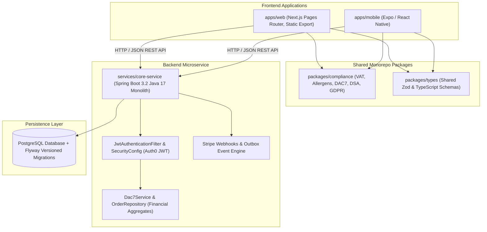

# INDEX.md — EUshop Repository Master Map & Navigation Index

> **Target Audience**: AI Agents, Systems Engineers, and Core Developers working on `Hostilian/eushop`.
> **Primary Source of Operational Truth**: [AGENTS.md](file:///d:/CODING/eushop/AGENTS.md) and [REFERENCE.md](file:///d:/CODING/eushop/REFERENCE.md).

---

## 1. Repository Overview

**EUshop** (`Hostilian/eushop`) is a full-stack, pan-European specialty food marketplace platform designed for compliant cross-border food commerce across all 27 EU Member States.

The system combines:
1. **Commerce Engine**: High-conversion Next.js static export frontend (`apps/web`) & Expo mobile client (`apps/mobile`).
2. **Regulatory Compliance Engine**: Single source of truth (`packages/compliance`) enforcing EU Regulation 1169/2011 (14 Food Allergens), DAC7 EU Tax Reporting (30 transactions / €2,000 threshold), One-Stop Shop (OSS) VAT calculation (€10,000 threshold), DSA Article 30 (Trader Identification), and GDPR Article 17/20 (Cascading Erasure).
3. **Core Backend Microservice**: Spring Boot 3.2 Java monolith (`services/core-service`) handling orders, payment idempotency via Stripe Java SDK, seller onboarding, and DAC7 reporting.
4. **Data Infrastructure**: PostgreSQL schema migrations managed via Flyway (`db/`).
5. **Cultural Food Atlas (V77)**: Geographic visual cartography mapping European food terroir, heritage recipes, and protected designations of origin (PDO/PGI/TSG).

---

## 2. Architecture at a Glance



---

## 3. Hierarchical Repository Map

```text
d:\CODING\eushop\
├── AGENTS.md                                → Monorepo rules, legal gate criteria, monorepo rules
├── INDEX.md                                 → Master navigation index (this file)
├── REFERENCE.md                             → Exhaustive technical reference & AI context
├── pnpm-workspace.yaml                      → PNPM workspace definition (apps/*, packages/*)
├── package.json                             → Root dependency configuration (PNPM 9.7.1)
├── docker-compose.yml                       → PostgreSQL 15 & local development environment
│
├── apps/                                    → User-Facing Client Applications
│   ├── web/                                 → Next.js 15 (Pages Router, Static Export on port 3002)
│   │   ├── pages/                           → Application routes (/?v=v243, /atlas, /cart, /become-seller)
│   │   ├── components/                      → UI components (atlas/, layout/, ui/, marketplace/)
│   │   ├── data/                            → Demo catalog, country taxonomy, version catalog
│   │   └── lib/                             → Degradation handling, cart safety, API client
│   └── mobile/                              → Expo / React Native mobile app
│
├── packages/                                → Shared Monorepo Logic (SINGLE SOURCE OF TRUTH)
│   ├── compliance/                          → Regulatory engine (Allergens, VAT, DAC7, DSA, GDPR, GPSR)
│   └── types/                               → Shared Zod & TypeScript schemas (Product, Seller, Order)
│
├── services/                                → Backend Microservices
│   └── core-service/                        → Spring Boot 3.2 Java 17 Monolith (Port 3001)
│       ├── pom.xml                          → Maven dependencies (Spring Boot, Stripe, Auth0 JWT)
│       └── src/main/java/com/eushop/core/   → Controllers, Services, Repositories, Config
│
├── db/                                      → Database Migrations
│   └── migrations/                          → Versioned SQL migrations (V1__init.sql, V2__dac7.sql, etc.)
│
└── scripts/                                 → Operations, Scripts & Automation
    ├── open-all-versions.ps1                → Local browser launcher for all version routes
    ├── check-secrets.ps1                    → Secret scanning prevention gate
    └── eushop_ai_orchestrator.py            → Autonomous multi-agent coordination orchestrator
```

---

## 4. Major Subsystems & Responsibilities

| Subsystem | Location | Primary Responsibility | Key Files |
| :--- | :--- | :--- | :--- |
| **Compliance Engine** | `packages/compliance` | Single source of truth for 14 EU allergens, DAC7 thresholds, OSS VAT calculation, and GDPR erasure logic. | [allergens.ts](file:///d:/CODING/eushop/packages/compliance/src/allergens.ts), [vat.ts](file:///d:/CODING/eushop/packages/compliance/src/vat.ts), [dsa.ts](file:///d:/CODING/eushop/packages/compliance/src/dsa.ts) |
| **Type Definitions** | `packages/types` | Canonical Zod schemas & TypeScript types shared across web, mobile, and compliance layers. | [product.ts](file:///d:/CODING/eushop/packages/types/src/product.ts), [order.ts](file:///d:/CODING/eushop/packages/types/src/order.ts) |
| **Web Frontend** | `apps/web` | High-converting Next.js Pages Router interface with static GitHub Pages export & interactive V77 European Food Atlas. | [index.tsx](file:///d:/CODING/eushop/apps/web/pages/index.tsx), [atlas/index.tsx](file:///d:/CODING/eushop/apps/web/pages/atlas/index.tsx), [demo-products.ts](file:///d:/CODING/eushop/apps/web/data/demo-products.ts) |
| **Backend Core** | `services/core-service` | Spring Boot 3.2 microservice providing authenticated REST endpoints, Stripe payment processing, and DAC7 aggregation. | [SecurityConfig.java](file:///d:/CODING/eushop/services/core-service/src/main/java/com/eushop/core/config/SecurityConfig.java), [Dac7Service.java](file:///d:/CODING/eushop/services/core-service/src/main/java/com/eushop/core/service/Dac7Service.java) |
| **DB Migrations** | `db` | Versioned PostgreSQL DDL & DML migration scripts. | [V1__init.sql](file:///d:/CODING/eushop/db/migrations/V1__init.sql), [V2__dac7.sql](file:///d:/CODING/eushop/db/migrations/V2__dac7.sql) |

---

## 5. Practical AI Task Lookup Table

| Task / Change Request | Primary Entry Point | Secondary / Related Files | Critical Considerations |
| :--- | :--- | :--- | :--- |
| **Modify EU VAT or DAC7 Thresholds** | `packages/compliance/src/vat.ts` | `packages/compliance/src/__tests__/compliance.test.ts` | **NEVER** hardcode VAT rates in `apps/web` or `services/core-service`. Always import from `packages/compliance`. |
| **Update Allergen Regulations (FIC 1169/2011)** | `packages/compliance/src/allergens.ts` | `apps/web/lib/food-information-completeness.ts` | Ensure string literal enum matches the 14 EU Annex II categories exactly (`Sulphur dioxide and sulphites`). |
| **Add / Edit Backend API Controller** | `services/core-service/src/main/java/com/eushop/core/controller/` | `SecurityConfig.java`, `JwtAuthenticationFilter.java` | Do **NOT** read `X-User-Id` from headers. Extract user identity directly from `Authentication` principal. |
| **Modify DAC7 Annual Tax Calculation** | `services/core-service/src/main/java/com/eushop/core/service/Dac7Service.java` | `OrderRepository.java`, `Dac7AggregateProjection.java` | Enforce valid reporting year bounds, `Math.toIntExact`, and `BigDecimal` rounding (`HALF_EVEN`). |
| **Update V77 European Food Atlas** | `apps/web/pages/atlas/index.tsx` | `apps/web/components/atlas/*`, `apps/web/data/atlas-countries.ts` | Preserve URL parameter synchronization (`?country=PT`, `?category=Cheese`) and microtask delay for state updates. |
| **Add / Edit Database Table Schema** | `db/migrations/` | `services/core-service/src/main/java/com/eushop/core/model/` | Create sequential Flyway script (`V4__name.sql`). Do not edit existing committed migration files. |

---

## 6. Recommended Reading Order for AI Agents

1. **[AGENTS.md](file:///d:/CODING/eushop/AGENTS.md)** — Core compliance non-negotiables, legal review gates, monorepo structure.
2. **[INDEX.md](file:///d:/CODING/eushop/INDEX.md)** (this document) — Navigation map and subsystem entry points.
3. **[REFERENCE.md](file:///d:/CODING/eushop/REFERENCE.md)** — Exhaustive technical reference, security model, and API schemas.
4. **`packages/compliance/src/`** — Canonical regulatory business logic.
5. **`services/core-service/src/main/java/com/eushop/core/config/SecurityConfig.java`** — Backend security architecture.
