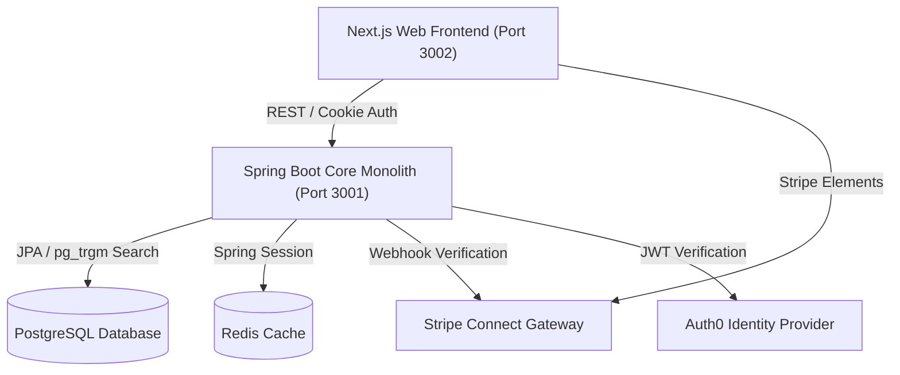

# 🌿 EUshop — Specialty Food Marketplace

EUshop is a premium, two-sided online marketplace connecting commercial sellers and consumer buyers of niche specialty foods (regional sweets, pantry staples, artisanal chocolates) strictly within the **EU Single Market**.

This platform is architected as a lean **Next.js Web Application** paired with a **Spring Boot Modular Monolith** backend, fully compliant with EU regulations (GDPR, DSA, DAC7).

---

## 🏛️ System Architecture



---

## 🚀 Getting Started

### Prerequisites
- **Node.js** v20+
- **pnpm** v9+
- **Java JDK** 17+
- **Maven** v3.8+
- **Docker** and **Docker Compose**

### 1. Clone & Install
```bash
git clone <repository-url>
cd eushop
pnpm install
```

### 2. Configure Environment
Create `.env.local` inside `apps/web` or follow the root `.env.example`:
```bash
cp .env.example .env
```

### 3. Spin Up Infrastructure
Start local PostgreSQL and Redis servers via Docker:
```bash
docker compose up -d
```

### 4. Run the Platform
In separate terminal sessions or tabs:
```bash
# Start Next.js Web Frontend (http://localhost:3002)
pnpm --filter @eushop/web dev

# Start Spring Boot Core Service (http://localhost:3001)
cd services/core-service
./mvnw.cmd spring-boot:run
```

---

<<<<<<< HEAD
## 🛡️ Regulatory Compliance & Security

For details on security architecture and vulnerability disclosure, see [SECURITY.md](file:///d:/CODING/eushop/SECURITY.md). For details on regulatory compliance status and gap analysis, see [COMPLIANCE_GAPS.md](file:///d:/CODING/eushop/COMPLIANCE_GAPS.md).

### General Data Protection Regulation (GDPR)
- **Article 17 Erasure ("Right to be Forgotten")**: Anonymises personal profiles and credentials while retaining order histories for tax audit obligations.
- **Article 20 Portability**: Users can download a full, machine-readable JSON copy of their stored account data.
- **Consent logging**: Automatically records and hashes User-Agent/IP details on any cookies preferences update.

### Digital Services Act (DSA)
- **Article 30/31 KYBC trader vetting**: Requires commercial sellers to have `kycVerified=true` and role `SELLER` to list items.
- **Recital 62 Verified reviews**: Limits listing reviews only to verified buyers with a `DELIVERED` order status.

=======
## 🛡️ Regulatory & Regulatory Compliance

### General Data Protection Regulation (GDPR)
- **Article 17 Erasure ("Right to be Forgotten")**: Anonymises personal profiles and credentials while retaining order histories for tax audit obligations.
- **Article 20 Portability**: Users can download a full, machine-readable JSON copy of their stored account data.
- **Consent logging**: Automatically records and hashes User-Agent/IP details on any cookies preferences update.

### Digital Services Act (DSA)
- **Article 30/31 KYBC trader vetting**: Requires commercial sellers to have `kycVerified=true` and role `SELLER` to list items.
- **Recital 62 Verified reviews**: Limits listing reviews only to verified buyers with a `DELIVERED` order status.

>>>>>>> pull-1
### DAC7 Tax Reporting Directive
- Captures seller taxation IDs, trade register records, and annual platform revenues for reporting to EU tax authorities.

---

## 📜 License

Proprietary — All Rights Reserved. Not to be shared or distributed.
