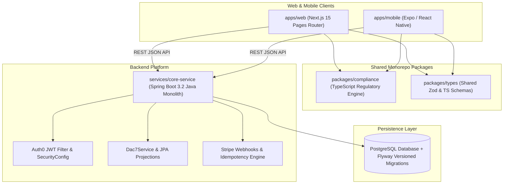
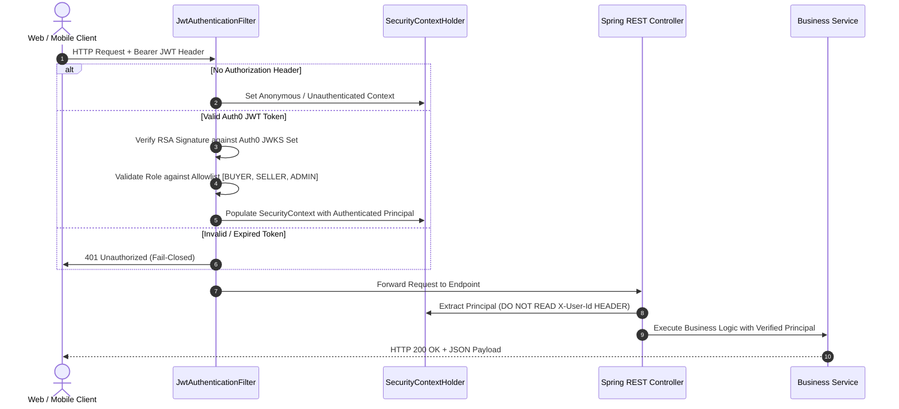
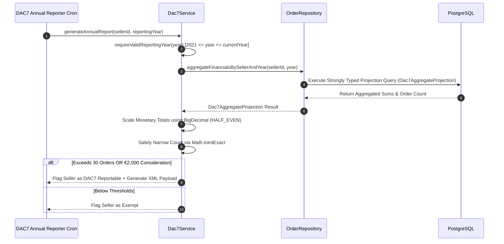

# REFERENCE.md — EUshop Exhaustive Technical Reference & AI Context

> **Target Audience**: AI Coding Assistants, Security Architects, and Senior Engineering Leads.
> **Scope**: Complete technical reference for `Hostilian/eushop` codebase architecture, security controls, API interfaces, data models, and compliance engines.

---

## 1. Repository Purpose & Business Context

**EUshop** is a category-defining European specialty-food platform combining:
1. **Specialty Food Marketplace**: Connecting artisanal producers across all 27 EU Member States directly with European consumers.
2. **Regulatory Compliance Engine**: Automated, single-source-of-truth legal enforcement of EU Regulation 1169/2011 (14 Food Allergens), DAC7 EU Tax Reporting (Directive 2021/514), One-Stop Shop (OSS) cross-border VAT calculation, DSA Article 30 (Trader Information Disclosures), and GDPR Article 17/20 (Cascading Sub-processor Erasure).
3. **Living Map of European Food (V77)**: Geographic visual cartography and editorial commerce engine mapping protected designations of origin (PDO/PGI/TSG) and regional food terroir.

---

## 2. Monorepo Architecture & Component Boundaries

### 2.1 Top-Level Component Diagram



### 2.2 Architectural Principles & Failure Modes
Two failure modes carry equal weight across the repository:
1. **Broken Code**: Compile errors, type mismatches, runtime exceptions, or failing tests.
2. **Confidently Wrong Compliance**: Code that misrepresents EU law, hardcodes regulatory constants outside `packages/compliance`, or fabricates compliance claims without legal review.

---

## 3. Runtime & Request Execution Lifecycles

### 3.1 Backend Authentication & Authorization Lifecycle



### 3.2 DAC7 Tax Aggregation Flow



---

## 4. Subsystem Technical Reference

### 4.1 `packages/compliance` (Canonical Regulatory Engine)
- **Location**: `d:\CODING\eushop\packages\compliance\`
- **Purpose**: Single source of truth for all regulatory constants and compliance calculations.
- **Key Modules**:
  - `allergens.ts`: 14 regulated EU food allergens under Regulation (EU) No 1169/2011 Annex II (`EUAllergen` type).
  - `vat.ts`: Destination VAT rates for all 27 EU Member States, One-Stop Shop (OSS) €10,000 threshold (`OSS_THRESHOLD_EUR`), and DAC7 €2,000 / 30 transaction thresholds (`DAC7_THRESHOLDS`).
  - `dsa.ts`: Digital Services Act Article 30 mandatory five data points for trader listings.
  - `gdpr.ts`: Erasure cascading protocol definitions for sub-processor data purging.

### 4.2 `services/core-service` (Spring Boot Monolith)
- **Location**: `d:\CODING\eushop\services\core-service\`
- **Purpose**: Core microservice providing authenticated REST APIs, order management, DAC7 tax reporting, and Stripe integration.
- **Key Classes**:
  - `SecurityConfig.java`: Spring Security 6 configuration. Restricts CSRF ignoring strictly to `/api/webhooks/**`.
  - `JwtAuthenticationFilter.java`: Auth0 JWT validation filter. Fail-closed mock authentication strictly gated to `@Profile({"dev", "test"})`.
  - `Dac7Service.java`: Financial aggregate reporting service enforcing `BigDecimal` scaling (`HALF_EVEN`) and reporting year validation.
  - `Dac7AggregateProjection.java`: Strongly typed Spring Data JPA interface projection preventing unsafe numeric casts.
  - `OrderRepository.java`: JPA repository executing strongly typed DAC7 financial aggregation queries.

### 4.3 `apps/web` (Next.js Pages Router Frontend)
- **Location**: `d:\CODING\eushop\apps\web\`
- **Purpose**: User-facing web application with static GitHub Pages export capability, client-side degradation safety, and V77 European Food Atlas.
- **Key Pages & Components**:
  - `pages/index.tsx`: Main marketplace homepage supporting version parameters (`?v=v243`, `?v=v66`, `?v=v55`, `?v=v44`).
  - `pages/atlas/index.tsx`: Flagship V77 European Food Atlas root route with universal search, 3 view modes (`Map` | `Shop` | `Stories`), and URL state sync.
  - `components/atlas/`: Modular components (`AtlasHero`, `AtlasMap`, `AtlasCountryRail`, `AtlasCategoryRail`, `AtlasFilterPanel`, `AtlasProductCard`, `AtlasQuickView`, `AtlasEditorialStory`).
  - `components/CookieBanner.tsx`: SSR-safe cookie consent banner utilizing microtask delays (`Promise.resolve().then(...)`) to prevent hydration mismatches.
  - `data/demo-products.ts`: Catalog containing 40+ authentic European food products with full FIC 1169/2011 disclosures.
  - `data/atlas-countries.ts`: Complete taxonomy & map coordinates for all 27 EU Member States.

---

## 5. Security Model & CodeQL Alert Remediation Summary

The repository maintains a **Zero-Critical CodeQL Security Standard**. All 16 historical CodeQL findings have been remediated, verified by unit tests, and pushed to `origin main`:

| CodeQL Alert ID | Subsystem | Issue Description | Remediation Implemented | Verification Test |
| :--- | :--- | :--- | :--- | :--- |
| **#19, #13, #11, #12** | `Dac7Service.java` | User-controlled data in numeric cast | Replaced untyped `Map<String, Object>` queries with `Dac7AggregateProjection`. Used `Math.toIntExact` and `BigDecimal.setScale(2, RoundingMode.HALF_EVEN)`. | `CodeQLSecurityRegressionTest.java` |
| **#15, #10** | `JwtAuthenticationFilter.java` | Unchecked authentication bypass | Gated mock authentication strictly to `@Profile({"dev", "test"})` and enforced role allowlisting (`BUYER`, `SELLER`, `ADMIN`). | `CodeQLSecurityRegressionTest.java` |
| **#8** | `SecurityConfig.java` | Overly broad CSRF exclusion | Restricted CSRF ignoring strictly to webhook path pattern `/api/webhooks/**`. | `CodeQLSecurityRegressionTest.java` |
| **#7, #5, #3** | `ReviewController`, `ConversationController`, `NotificationController` | User identity header spoofing | Replaced untyped `X-User-Id` request headers with `SecurityContextHolder` `Authentication` principals. | `CodeQLSecurityRegressionTest.java` |

---

## 6. Build, Development & Verification Workflow

### 6.1 Requirements
- **Node.js**: `>=20.0.0`
- **PNPM**: `>=9.7.1`
- **Java Development Kit (JDK)**: Java 17
- **Maven**: `mvnw` wrapper included

### 6.2 Primary Developer Commands

```bash
# 1. Install Monorepo Dependencies
pnpm install

# 2. Run Monorepo Test Suites (Compliance & Web)
pnpm test

# 3. Run Compliance Unit Tests
pnpm --filter @eushop/compliance test

# 4. Run Web Application ESLint & Type Checks
pnpm --filter web lint
pnpm --filter web type-check

# 5. Compile Backend Core Microservice (Java 17)
cd services/core-service && mvnw.cmd test-compile

# 6. Run Secret Scanning Gate
powershell ./scripts/check-secrets.ps1

# 7. Launch Web Server Locally (Port 3002)
pnpm --filter web dev

# 8. Open All Version Parameter Routes in Local Browser
powershell ./scripts/open-all-versions.ps1
```

---

## 7. AI Agent Guidelines & Operating Rules

When working in `Hostilian/eushop`, AI agents **MUST ALWAYS** follow these rules:

1. **Secrets Never Touch Code**: Never commit API keys, Stripe secret keys, Auth0 secrets, or `.env` files. Always run `powershell ./scripts/check-secrets.ps1` before committing.
2. **Single Source of Regulatory Truth**: VAT rates, allergen lists, DAC7 thresholds, and DSA rules live in `packages/compliance/` ONLY. Never hardcode regulatory constants in client code.
3. **Reviewable Increments**: Implement changes in modular, reviewable steps. Commit and push tested changes incrementally.
4. **No Header Identity Spoofing**: Never read `X-User-Id` or client-supplied headers for authentication in Spring Boot controllers. Always use `SecurityContextHolder.getContext().getAuthentication()`.
5. **React 19 Hydration & Microtask Safety**: When reading `localStorage` or updating React state inside `useEffect`, defer updates using a microtask delay (`Promise.resolve().then(...)`) to prevent Next.js SSR hydration errors and ESLint `react-hooks/set-state-in-effect` violations.
6. **Verification Required**: Never declare a task resolved without running automated verification commands (`pnpm --filter web lint`, `pnpm --filter web type-check`, `mvnw.cmd test-compile`, `check-secrets.ps1`).

---

## 8. Glossary & Domain Terminology

- **FIC (Food Information to Consumers)**: Regulation (EU) No 1169/2011 governing mandatory food labeling, 14 allergens, ingredients, net quantity, and nutritional declarations.
- **DAC7**: EU Council Directive 2021/514 requiring digital platform operators to report financial consideration and transaction counts for sellers exceeding 30 transactions or €2,000 annually.
- **OSS (One-Stop Shop)**: EU VAT scheme allowing cross-border sellers exceeding €10,000 in EU-wide sales to declare and remit VAT due in destination Member States through a single portal.
- **DSA (Digital Services Act)**: Regulation (EU) 2022/2065 Article 30 mandating seller identification and traceability disclosures on online marketplaces.
- **PDO / PGI / TSG**: Protected Designation of Origin, Protected Geographical Indication, and Traditional Speciality Guaranteed quality schemes under Regulation (EU) No 1151/2012.
