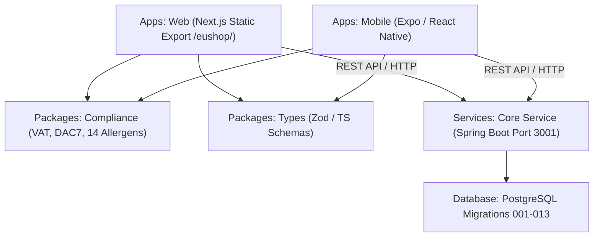

# EUshop Current Monorepo Architecture & System Map

> **Repository State**: Version 44  
> **Primary Workspace**: `D:\CODING\eushop`

---

## 1. System Topology & Architectural Layers

---

## 2. Component Package Inventory

| Component Path | Tech Stack | Purpose |
| :--- | :--- | :--- |
| `apps/web/` | Next.js 14, React 18, TailwindCSS | Web marketplace frontend, seller onboarding, checkout. |
| `apps/mobile/` | Expo 50, React Native | Mobile marketplace application shell. |
| `packages/compliance/` | TypeScript, Jest | **Single source of truth** for EU VAT, DAC7, and 14 Allergens. |
| `packages/types/` | TypeScript, Zod | Shared type definitions and runtime validation schemas. |
| `services/core-service/` | Java 17, Spring Boot, Maven | Core backend service monolith. |
| `db/migrations/` | PostgreSQL SQL scripts | Database schema migrations `001_initial_schema.sql` to `013_order_vat_fields.sql`. |

---

## 3. Database Migration Sequence (`db/migrations/`)

1. `001_initial_schema.sql` — Core tables (users, products, orders).
2. `002_compliance_fields.sql` — Allergen and origin columns.
3. `003_consent_log.sql` — GDPR user consent log table.
4. `004_dac7_reporting.sql` — Seller annual consideration and transaction tracking.
5. `005_food_rating_materialized_view.sql` — Product rating aggregation view.
6. `006_pg_trgm_search_index.sql` — Trigram search index for fast fuzzy search.
7. `007_add_processed_webhook_events.sql` — Payment webhook idempotency.
8. `008_indexes_and_compliance.sql` — Index optimization on food listings.
9. `009_android_device_tokens.sql` — Push notification tokens.
10. `009b_chat_enhancements.sql` — Real-time messaging schema.
11. `010_group_chat_enhancements.sql` — Buyer-seller messaging threads.
12. `011_message_metadata.sql` — Message attachment metadata.
13. `012_gdpr_erasure_columns.sql` — GDPR Art. 17 cascading erasure fields.
14. `013_order_vat_fields.sql` — Per-order destination VAT audit fields.
