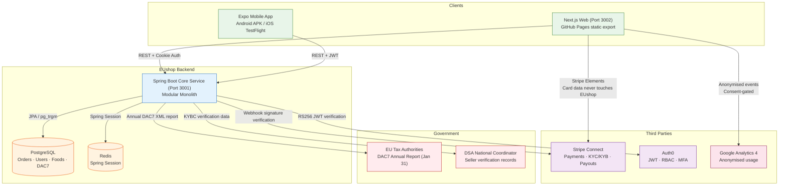
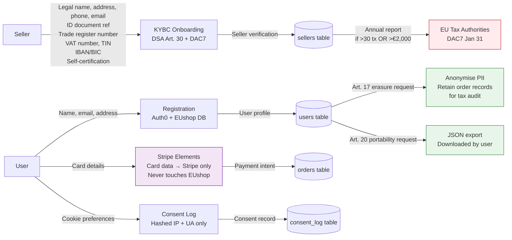
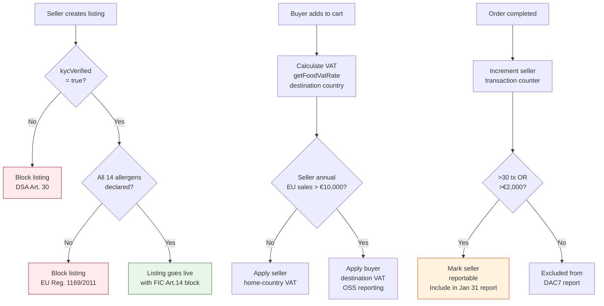
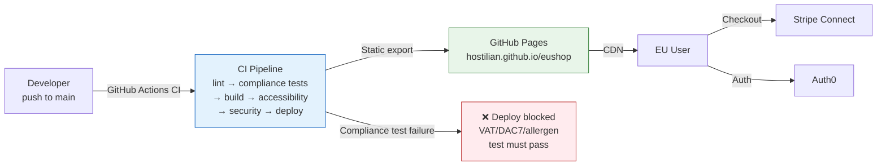

# EUshop — Data Flow & Compliance Architecture

> Generated as part of Phase 2 compliance deliverables.
> COMPLIANCE-REVIEW: This diagram must be reviewed by a DPO before any
> compliance claim is made about data handling. It reflects the intended
> architecture, not a certified audit.

---

## System Architecture

---

## Personal Data Flow

---

## Compliance Code Paths

---

## Deployment Architecture

---

## Incident Response Runbook

### Scenario 1: Incorrect VAT rate shipped to production

1. **Detect:** Compliance engine alert fires (VAT calculation returns unexpected value)
2. **Assess:** Check `packages/compliance/src/vat.ts` — which country rate is wrong?
3. **Contain:** Use feature flag to disable checkout for affected destination country
4. **Fix:** Update `EU_FOOD_VAT_RATES` with correct rate, add fixture test
5. **Verify:** Run `pnpm --filter @eushop/compliance test` — all tests must pass
6. **Deploy:** Merge fix, CI compliance tests gate the deploy
7. **Notify:** If orders were charged the wrong VAT, notify affected buyers and issue corrections
8. **Post-mortem:** Document in CHANGELOG.md

### Scenario 2: Seller DSA verification data found to be fraudulent

1. **Detect:** Admin report or authority notification
2. **Contain:** Set `kycVerified = false` and `suspensionStatus = 'suspended'` immediately (DSA requires swift action)
3. **Notify buyers:** Query orders from the preceding 6 months (DSA Art. 32 obligation)
4. **Preserve evidence:** Do not delete seller data — retain for legal proceedings
5. **Report:** Notify DSA national coordinator if required
6. **Post-mortem:** Review KYBC verification process

### Scenario 3: GDPR erasure request

1. Receive request at privacy@eushop.com
2. Verify identity of requester
3. Run `UserService.anonymizeUser(userId)` — anonymises PII, retains anonymised order records
4. Request deletion from Stripe (payment data) and Auth0 (credentials)
5. Confirm deletion in writing within 30 days
6. Log in ROPA

---

## Pre-Launch Legal Sign-Off Checklist

> **Human-only — no coding agent should mark these as done.**

- [ ] Lawyer confirms Privacy Policy, Cookie Policy, Terms, Refund Policy for each launch jurisdiction
- [ ] Tax advisor confirms VAT/OSS/IOSS registration and SME-scheme eligibility
- [ ] DAC7 registration/reporting-jurisdiction confirmed
- [ ] DSA obligations tier confirmed with national digital-services coordinator
- [ ] DPO sign-off on ROPA/DPIA (especially allergy-data special-category question)
- [ ] Explicit legal sign-off before any biometric processing is built
- [ ] Insurance/liability review for DSA safe-harbor posture
- [ ] PCI-DSS SAQ A self-assessment completed and confirmed
