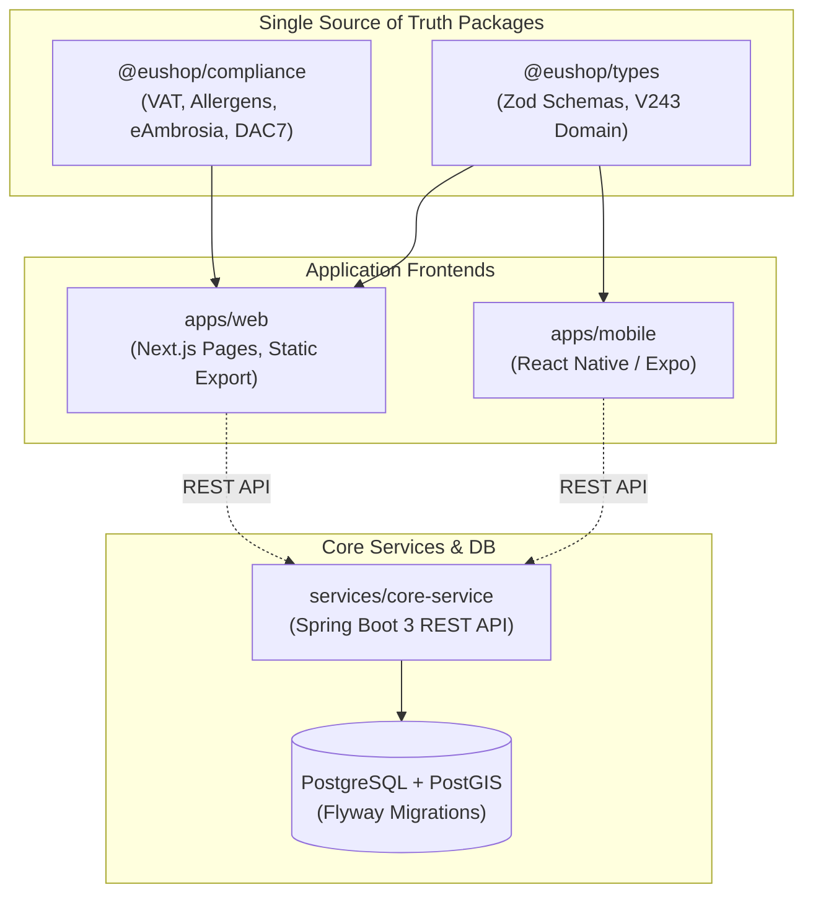

# EUshop V243 — Monorepo Dependency Graph & Architecture Mapping

---

## Shared Package Ownership Rules

1. **Regulatory Single Source of Truth**: All VAT rates, allergen constants, DAC7 thresholds, and eAmbrosia GI definitions MUST reside exclusively in `packages/compliance/`.
2. **Type Safety**: All API requests, response payloads, and domain models MUST consume Zod schemas from `packages/types/`.
3. **No Direct Mutative Parallel Schema Changes**: Schema changes require a `schema-request` document under `docs/v243/schema-requests/` before Flyway migration modification.
