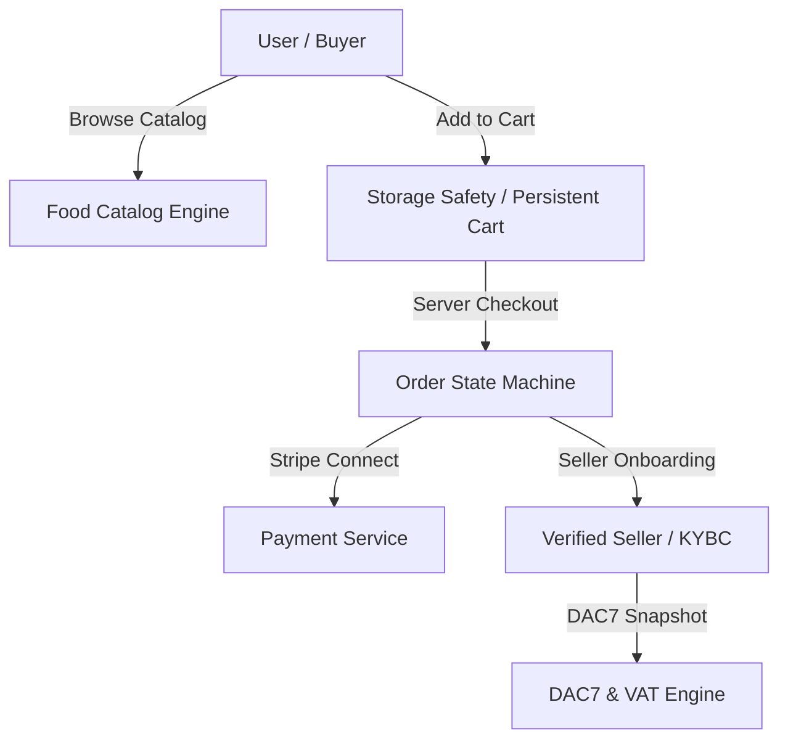

# EUshop Product Truth & Canonical Architecture Reconciliation

**Date:** 2026-07-22  
**Status:** VERIFIED BY SOURCE CODE  
**Target Release:** EUshop v66  

---

## 1. Product Thesis & Customer Conflict Resolution

### Primary Canonical Product: Two-Sided EU Specialty-Food Marketplace
EUshop is fundamentally an **authentic European specialty-food and PDO/PGI regional marketplace** facilitating cross-border trade between verified EU producers/sellers and consumers.

- **Primary Supply Side**: Verified EU artisanal food producers, regional farms, and specialty traders.
- **Primary Demand Side**: EU consumers seeking authentic, origin-verified specialty food with full FIC 1169 allergen disclosures.
- **Core Value Proposition**: Verified origin (PDO/PGI/TSG), 100% legal compliance (14 Annex II allergens, DAC7 tax transparency, DSA trader identity), and transparent cross-border shipping.

### Secondary Mobility / Trip Marketplace Module
Cross-border peer traveler exchange and mobility routing exist as an optional secondary fulfillment module (`services/core-service/src/main/java/com/eushop/core/entity/Order.java`), allowing peer travelers to assist in cross-border handoff.

- **Constraint**: Peer travel handoffs must conform to identical VAT, allergen, and trader identification rules as direct seller shipping.

---

## 2. Canonical Domain Models & Data Boundaries

### Domain Boundaries
1. **Catalog & Compliance**: Single source of truth in `packages/compliance` for allergens, VAT rates, and DAC7 thresholds.
2. **Order State Machine**: Enforces valid transitions (`PENDING_PAYMENT` → `PAID` → `SHIPPED` → `DELIVERED` / `DISPUTED` → `REFUNDED`).
3. **Seller Verification Gate**: Unverified sellers cannot publish listings without KYC and self-certified legal compliance.
