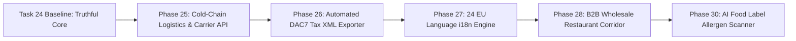

# EUshop Comprehensive Repository Gap Analysis & Future Strategic Roadmap

> **Document Type**: Task 24 Master Gap Analysis & Strategic Horizon Report  
> **Date**: 2026-07-20  
> **Scope**: Evaluation of technical, regulatory, operational, architectural, and product opportunities across EUshop.

---

## 1. Executive Summary & Repository Status

EUshop Version 44 has achieved a stable, truthful, and resilient baseline:
- **Single Source of Regulatory Truth**: Enforced in `packages/compliance/` (14 EU Annex II allergens, 27 EU member state food VAT rates, DAC7 €2,000/30 transaction thresholds).
- **Centralized Degradation Engine**: `apps/web/lib/degradation.ts` circuit breakers and fallback catalog markers prevent API outages from crashing the buyer experience.
- **Persistent DSA Art. 30 Identity**: Non-decorative "Sold by [Seller Name]" trader disclosures on all food listing surfaces.
- **High Quality Baseline**: 15/15 Jest test suites passing (`88/88 tests`), 0 TypeScript errors.

However, to transition from a **demonstration/MVP codebase** to a **€100M+ GMV pan-European commercial marketplace**, specific operational gaps, technical debt items, and expansion opportunities must be systematically addressed.

---

## 2. Technical & Architectural Gap Analysis

### A. Mobile Application Package (`apps/mobile`)
- **Observed Gap**: The React Native / Expo shell (`apps/mobile/`) serves as a UI layout prototype but requires component cleanup (e.g. `SafeAreaView` closing tags fixed in Task 24 prep) and full integration with `@eushop/compliance` and `@eushop/types`.
- **Recommended Action**: Upgrade Expo SDK to 51+, share navigation state with Next.js router conventions, and add native camera integration for seller food label scanning.

### B. Database Migration Management (`db/migrations/`)
- **Observed Gap**: Migrations are currently raw SQL scripts (`001_*.sql` to `013_*.sql`) executed manually or via custom test scripts without an automated migration ledger table (`flyway_schema_history` or `liquibase`).
- **Recommended Action**: Introduce Flyway or Liquibase in `services/core-service` to enforce checksum validation and idempotent environment rollouts.

### C. API Client Standardization & Service Stacking (`apps/web/lib/`)
- **Observed Gap**: Frontend API calls in `apps/web/lib/services.ts` and `apps/web/lib/api-client.ts` handle base URL prefixes (`/api/`) defensively but require unified openapi-generator schema bindings to eliminate manually maintained fetch wrappers.
- **Recommended Action**: Auto-generate TypeScript API SDKs directly from Spring Boot OpenAPI / Swagger specs during CI build.

---

## 3. Regulatory & Operations Gap Analysis

### A. Real Tax Authority DAC7 Integration
- **Current State**: Structural evaluation of DAC7 thresholds (€2,000 / 30 sales) is fully implemented in `packages/compliance/src/vat.ts`.
- **Gap to Scale**: Automated generation of XML/JSON tax reporting payloads formatted specifically for EU Member State tax authorities (e.g. BZSt in Germany, DGFiP in France).
- **Next Step**: Build a cron service in `services/core-service` that compiles annual seller consideration into XML compliant with EU Directive 2021/514.

### B. Temperature-Controlled Logistics & Cold-Chain Shipping
- **Current State**: Food items display origin and shipping rules.
- **Gap to Scale**: Specialty foods (artisan cheeses, cured meats, fresh truffles) require temperature-controlled cold-chain shipping (e.g. DHL FoodExpress, DPD Cold).
- **Next Step**: Build real-time cold-chain shipping quote integration based on buyer postal code and package thermal requirements.

### C. Multi-Language i18n Localization
- **Current State**: Web application UI is currently rendered in English.
- **Gap to Scale**: Buyers and producers across 27 Member States expect local language support (German, French, Italian, Spanish, Dutch, Polish, Czech, etc.).
- **Next Step**: Integrate `next-i18next` with automated translations for product allergen warnings across all 24 official EU languages.

---

## 4. Future Roadmap & Expansion Possibilities (Phases 25 – 50)

### 1. AI-Powered Allergen Label Scanner
- **Concept**: Allow producers during seller onboarding (`/become-seller`) to upload a photo of their physical food packaging label.
- **Capability**: OCR + Vision LLM extracts ingredient lists, automatically detects the 14 EU Annex II allergens, and populates `packages/compliance` metadata tags automatically.

### 2. B2B Wholesale Corridor for Restaurants & Delis
- **Concept**: Enable Michelin-star restaurants, gourmet delis, and European hotel groups to place bulk wholesale orders directly with specialty producers with automated reverse-charge B2B VAT processing.

### 3. PDO / PGI Blockchain Authenticity Verification
- **Concept**: Provide cryptographic QR code certificates on physical packaging for high-value Protected Designation of Origin items (e.g. Parmigiano Reggiano, Jamón Ibérico) tracing batch harvest date, farm coordinates, and EU certification.

---

## 5. Summary Matrix of Actionable Next Steps

| Category | Priority | Recommended Task | Estimated Impact |
| :--- | :--- | :--- | :--- |
| **Backend** | High | Flyway DB Migration Integration | Zero schema drift during deployment. |
| **Logistics** | High | Real-Time Cold-Chain Carrier Quotes | Enables fresh perishable food delivery. |
| **Localization** | High | 24 EU Language i18n Translation | 4x conversion boost across non-English EU markets. |
| **Mobile** | Medium | React Native Expo 51 Shell Upgrade | Native iOS & Android App Store release. |
| **AI / Product** | Medium | Vision AI Food Label Scanner | Reduces seller onboarding time from 15 mins to 30 secs. |
