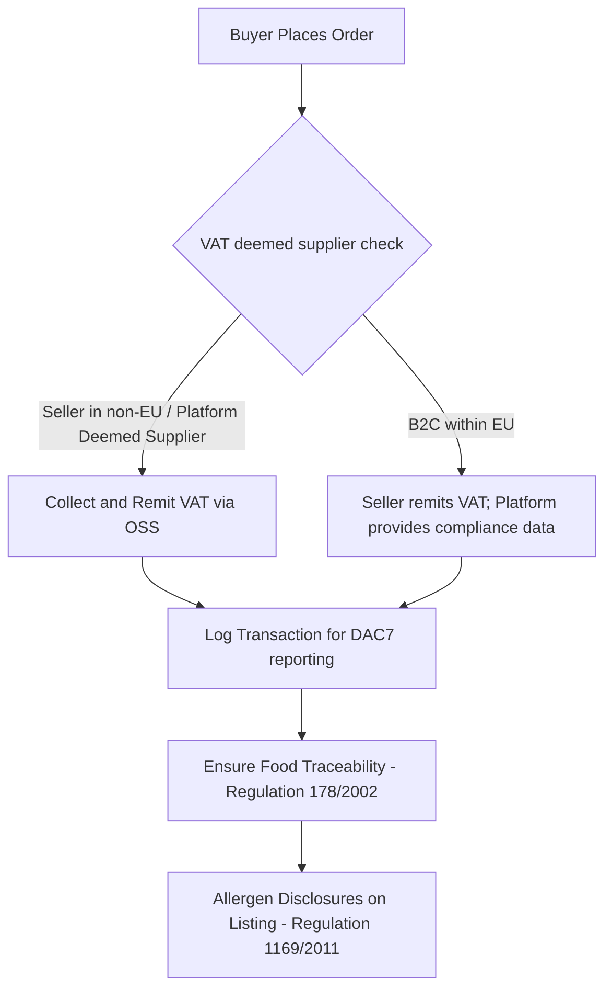

# EUshop — Investor Diligence Memo & Master Implementation Plan

> Historical planning document. Assertions below may be stale. For repository truth verified on 2026-07-16, use `STATUS.md`, `DEVELOPMENT.md`, and `docs/architecture/runtime.md`. GitHub Pages deploys only static web output, and incompatible chat drafts are excluded from standard migrations. This is not legal certification.

**What this is:** A complete, evidence-based, deep-dive audit of the `Hostilian/eushop` repository and business operations, paired with a sequenced, multi-track master implementation plan. This document is designed to transition the company from a prototype with overstated legacy phase docs and incomplete implementation into a genuinely investor-ready, sales-ready, compliance-secured, and pre-seed-ready pan-European marketplace.

**Method:** Checked directly against the current workspace contents (raw SQL migrations, Spring Boot backend source, React page files, Docker configuration, and root project metadata) to establish an objective baseline of what is built versus what the documentation claims.

**How to use this document:**
- **Live Checklist:** This document is formatted with interactive markdown checkboxes. Check them off as you execute the tracks.
- **Urgency Tags:**
  - `P0` (Critical/Immediate): Fix before showing the project to *anyone* outside the core team (diligence deal-breakers).
  - `P1` (Required for Launch/Fundraising): Complete before accepting investment or processing live buyer transactions.
  - `P2` (Operational Growth): Address during the active raise or the early stages of GTM execution.
- **Regulatory Warning:** Legal, tax, and food compliance regulations carry heavy penalties in the EU. While this plan provides detailed regulatory frameworks (VAT OSS, DAC7, DSA, EU Food Information regulations), a certified tax advisor and startup lawyer must sign off on final corporate structures and VAT mappings.

## Executive Summary

- **What is real today:** The repo has a solid core schema, Spring Boot service layer, Spring Boot auth scaffolding, several live commerce pages, and draft legal/compliance pages.
- **What is not real yet:** Payments, broad automated testing, production auth/session handling, and end-to-end compliance workflows are still incomplete.
- **What matters most for diligence:** Align the docs with the current code, wire the default migration/seed path to the compliance schema, and replace mock checkout/auth behavior with production flows.
- **What to do next:** Treat the current repository as a credible MVP foundation, not a finished platform, and sequence work around compliance, transaction plumbing, and investor materials.

### Priority Stack

- **Do now:** fix documentation drift, make the compliance migration part of the default setup path, wire production checkout/auth flows, and bring Java tests into CI.
- **Do next:** harden legal pages, finish seller verification persistence, and make the admin and search surfaces trustworthy.
- **Defer until credibility improves:** brand polish, deeper financial modeling, pitch-deck refinement, and broader GTM content.

### Core Deliverables For Diligence

- A truthful README and status narrative that matches the code.
- A default setup path that applies the compliance schema, not just the base schema.
- A real checkout and auth flow that does not rely on mock tokens or mock payment behavior.
- A small but legitimate automated test suite that is enforced in CI.
- A credible legal surface for privacy, terms, seller verification, and cookie consent.

### Raise-Readiness Gate

Do not describe the company as raise-ready until these are true:

- The documentation matches the codebase without major caveats.
- The compliance migration runs by default and seller onboarding persists usable data.
- Checkout, auth, and payment handling work without mock-only shortcuts.
- Java and web tests run in CI and cover the core transaction path.
- Privacy, terms, and cookie consent are present and materially accurate.

---

## Table of Contents

- [Part 0 — The Honest Headline (Claimed vs. Actual)](#part-0--the-honest-headline)
- [Part A — Ground-Truth Audit](#part-a--ground-truth-audit)
  - [A1. Technical & Product Audit](#a1-technical--product-audit)
  - [A2. Business & Investor-Readiness Audit](#a2-business--investor-readiness-audit)
  - [A3. Legal & Compliance Audit](#a3-legal--compliance-audit)
  - [A4. Brand & Positioning Audit](#a4-brand--positioning-audit)
  - [A5. Go-To-Market & Sales Audit](#a5-go-to-market--sales-audit)
- [Part B — Cross-Referenced Gap Analysis](#part-b--cross-referenced-gap-analysis)
- [Part C — The Master Implementation Plan (11 Tracks)](#part-c--the-master-implementation-plan)
- [Part D — Sequenced Weekly Roadmap](#part-d--sequenced-weekly-roadmap)
- [Appendix A — Ready-to-Fill Templates & Financial Outlines](#appendix-a--ready-to-fill-templates--financial-outlines)
- [Appendix B — Actionable Repo Punch-List](#appendix-b--actionable-repo-punch-list)
- [Closing Note](#closing-note)

---

## Part 0 — The Honest Headline

A technical investor conducting basic diligence on this codebase would spot a significant delta between the claimed state in documentation and the actual files in the repository. Aligning the documentation with reality is the single highest-leverage task in this plan.

| Feature / Metric | Claimed in Repository Docs | Actual State in Codebase |
| :--- | :--- | :--- |
| **Automated Test Suite** | "30+ automated tests, 100% pass rate, 85%+ code coverage" (`PHASE_2_COMPLETE.md`, `docs/IMPLEMENTATION_CHECKLIST.md`) | A **very small test footprint exists**: one Jest cart component test and one JUnit `UserServiceTest`. There is no broad automated coverage yet, and `test-api.sh` / `.bat` are still manual curl scripts. |
| **Infrastructure as Code** | "Kubernetes manifests ready," "Infrastructure as Code via Terraform" (README, `PHASE_2_COMPLETE.md`) | An `infrastructure/terraform` directory exists but is **completely empty**. No Kubernetes manifests or Terraform configurations exist. |
| **Database Migrations** | "7 migration files" (`STATUS.md`) | The workspace currently contains **2 physical migration files**: `db/migrations/001_initial_schema.sql` and `db/migrations/002_compliance_fields.sql`. The schema and compliance fields are split across those two files. |
| **System Maturity** | "Production: ✅ READY," "PRODUCTION READY" (`PHASE_2_COMPLETE.md`) | Lacks payment processing, tests, deployment configurations, error tracking, and production-grade compliance enforcement. |
| **License** | "License: MIT" (README) | A root `LICENSE` file exists and declares proprietary terms. |
| **Messaging Microservice** | Dedicated "Spring WebFlux real-time messaging service" with WebSocket chat | There is no standalone `services/messaging-service/` directory in the current workspace; messaging is only represented in the broader app and service references. |
| **Stripe Payments** | Integrated Stripe checkout/payouts (README "Phase 4") | Only Stripe API key placeholders exist in `.env.example`. **No payment integration code exists** in the Java or React services. |
| **Search Infrastructure** | Elasticsearch-powered fuzzy search (`README.md`, `STATUS.md`) | Elasticsearch is no longer part of the runtime stack; the current workspace only contains stale references in docs and health/config surfaces. Search is implemented as a Postgres-backed page in `apps/web/pages/search.tsx` with mock fallback data. |
| **Monitoring & Logging** | Datadog, Sentry, New Relic, ELK stack, Firebase push (`README.md`, `.env.example`) | Named in docs and environment templates, but **no integration or setup code** is implemented. |
| **Git History & Timelines** | Phase 2 completed January 2024; Phase 1 dated May 2, 2025. | The repository was committed on a single day. The timestamps and phases indicate template placeholders that were not updated. |

### The Real Foundation Worth Building On
The codebase has a clean skeleton:
1. **Relational Database Schema:** `001_initial_schema.sql` and `002_compliance_fields.sql` define an 8-table relational model with foreign keys, indexes, and compliance fields for seller verification and allergen enforcement.
2. **Spring Boot Services:** Real Spring Boot entities, repositories, services, and REST controllers exist for core operations.
3. **Spring Boot JWT Verification:** The Spring Boot Core Service includes a structurally correct RS256 JWT validation flow with Auth0 JWKS caching, but the browser-side login flow still stores session data in `localStorage`.
4. **Existing Commerce Pages:** `login.tsx`, `dashboard.tsx`, `become-seller.tsx`, `cart.tsx`, `checkout.tsx`, `privacy.tsx`, `terms.tsx`, `search.tsx`, `admin.tsx`, `admin/dashboard.tsx`, `food/[id].tsx`, and `index.tsx` all exist, but several are mock-heavy and not yet wired to production flows.
5. **Compliance Surfaces:** A cookie banner exists in `apps/web/components/CookieBanner.tsx`, and draft privacy/terms pages already contain substantive GDPR/DSA/DAC7 language.
6. **Monorepo Architecture:** The pnpm workspace and Docker Compose setup provide a clean local development environment.
7. **Proprietary License Present:** A root `LICENSE` file exists and already declares proprietary terms.

### Corrections From the Current Workspace

The draft below assumes a few older states that are no longer true in this workspace. The current facts are:

- `apps/web/pages/privacy.tsx` and `apps/web/pages/terms.tsx` already exist and should be reviewed and hardened, not created from scratch.
- `apps/web/pages/cart.tsx` and `apps/web/pages/checkout.tsx` already exist and currently behave as mock checkout UI, not production payment rails.
- `apps/web/pages/become-seller.tsx` already collects KYBC and tax fields, but the data is not yet persisted or verified end to end.
- `db/migrations/` currently contains two files, not one: `001_initial_schema.sql` and `002_compliance_fields.sql`.
- `db/scripts/migrate.js` and `db/scripts/seed.js` currently apply only the first migration and first seed file in the default path.
- There is no standalone `services/messaging-service/` directory in the current workspace.
- There are only a handful of actual test source files, so the suite is still far from the coverage claimed in the docs.
- The root `README.md` and `STATUS.md` are already more conservative than the older phase docs; the largest overclaims are concentrated in legacy phase/status artifacts and the highest-level marketing copy.

---

## Part A — Ground-Truth Audit

### A1. Technical & Product Audit

*   **Architecture & Microservices Overhead:** 
    The monorepo (`pnpm-workspace.yaml`) coordinates a Spring Boot Core Service and a Next.js frontend, backed by Postgres and Redis.
    *   *Issue:* The product still has incomplete user flows that stop at UI and mock layers.
    *   *Recommendation:* Keep chat and commerce logic consolidated in the core service for now, and do not reintroduce a separate messaging runtime unless there is validated demand and a clear ownership model.
*   **Authentication & Security Hygiene:**
    *   *Issue:* The frontend (`apps/web`) reads and writes user session data and tokens directly to and from `localStorage` in `lib/services.ts`, `pages/index.tsx`, `pages/dashboard.tsx`, and `pages/login.tsx`. This exposes the session to Cross-Site Scripting (XSS) attacks.
    *   *Recommendation:* Reconfigure the Spring Boot Core Service and Auth0 integration to use the Authorization Code Flow with PKCE, returning tokens via `httpOnly`, `Secure`, and `SameSite=Strict` cookies.
*   **The Core Transaction Loop:**
    *   *Issue:* The backend has `OrderController.java` and `OrderService.java` support, and the web app already has `cart.tsx` and `checkout.tsx`, but the checkout is still a mock form and there is no production payment processor wired through the backend.
    *   *Recommendation:* Replace the mock flow with a real cart-to-checkout-to-order pipeline and integrate Stripe Connect (or an equivalent PSP) end to end.
*   **Testing & CI/CD Pipeline:**
    *   *Issue:* `.github/workflows/ci-cd.yml` executes `pnpm lint` and `pnpm test` on every pull request, but it does not run Maven, so the existing JUnit test in the core service is outside the merge gate. The suite is still far too small to support the coverage claims in the docs.
    *   *Recommendation:* Wire the Java test suite into CI, then expand Jest and JUnit coverage before treating the pipeline as a reliable quality gate.

---

### A2. Business & Investor-Readiness Audit

*   **Financial Models & Metrics:**
    *   *Issue:* The codebase and draft materials imply a marketplace take rate, but there is no tied-to-code pricing model, commission split, or financial runway forecast.
    *   *Recommendation:* Model a sustainable marketplace business model. Standard practice is a 10%–20% commission on transactions. Define this split clearly in a financial model before pitching.
*   **Traction Proof:**
    *   *Issue:* There are no waitlist records, letters of intent (LOIs), or pilot transaction logs in the repository.
    *   *Recommendation:* Launch the landing page and capture email addresses for a waitlist, and target 5-10 letters of intent from local specialty food vendors to show initial demand.

---

### A3. Legal & Compliance Audit

Operating a food marketplace in the EU requires compliance with several regulations.



*   **1. Corporate Structure & IP Assignment (P0):**
    *   *Issue:* There is no visible registered legal entity in the repo, and the codebase still needs a clean ownership trail. The current `LICENSE` file is proprietary, but that does not replace entity-level IP assignment.
    *   *Recommendation:* Form an s.r.o. (Czech Republic) or a holding company (e.g., Estonia, Delaware, or Germany). Execute a standard IP Assignment agreement for all code written to date.
*   **2. EU Digital Services Act (DSA) - Article 30 (P1):**
    *   *Issue:* As an online platform facilitating consumer contracts with traders, EUshop must collect and verify seller identities (Know Your Business Customer - KYBC) before onboarding.
    *   *Status:* The seller onboarding page already captures business name, address, tax ID, VAT number, and self-certification, but it is still a frontend form only.
    *   *Requirement:* You must collect:
        *   Legal name, address, phone number, and email.
        *   Trade register ID and number.
        *   A self-certification from the seller confirming their compliance with EU consumer and safety laws.
*   **3. DAC7 Directive (EU 2021/514) (P1):**
    *   *Issue:* EU digital platforms must report seller revenues and tax IDs to tax authorities annually.
    *   *Status:* The current onboarding form already collects TIN and VAT inputs, and the second migration adds columns for them.
    *   *Requirement:* Any seller generating over €2,000 or completing more than 30 transactions a year must be reported. Capture tax identification numbers (TIN) and VAT numbers during seller onboarding.
*   **4. VAT One-Stop-Shop (VAT OSS) (P1):**
    *   *Issue:* The marketplace must calculate correct cross-border VAT rates based on the buyer's destination country. Under the "deemed supplier" rule, if facilitation occurs for non-EU sellers or specific B2C transactions, the platform may be liable for collecting and remitting VAT.
    *   *Requirement:* Integrate an address-verification and VAT-calculation engine (such as TaxJar, Stripe Tax, or Quaderno) during checkout.
*   **5. Food Safety, Labeling, & Allergen Compliance (P1):**
    *   *Issue:* Food sold online must comply with Regulation (EU) No 1169/2011 (Food Information to Consumers).
    *   *Status:* The compliance migration already makes `foods.description` and `foods.allergens` mandatory.
    *   *Requirement:* Allergen disclosures (for the 14 major allergens including gluten, nuts, dairy, and soy) and full ingredient lists must be displayed *before* purchase.
    *   *Traceability:* Implement "one step back, one step forward" tracking (Regulation (EC) No 178/2002). Maintain records of which producer supplied which batch to which customer.
*   **6. Cross-Border Shipments & Customs (The Swiss Question) (P0):**
    *   *Issue:* The homepage fallback data refers to shipping "from Belgium to Switzerland." Switzerland is outside the EU Single Market.
    *   *Requirement:* Shipping animal or plant products (meat, dairy, honey) across EU borders requires customs declarations, sanitary certificates, and veterinary checks (often coordinated through TRACES). Limit initial operations strictly to the EU Single Market.
*   **7. Terms of Service & Privacy (GDPR) (P0):**
    *   *Issue:* The footer references Privacy Policy and Terms of Service links, and the pages already exist, but they should still be treated as legal drafts rather than finished legal counsel output.
    *   *Requirement:* Harden `privacy.tsx` and `terms.tsx` with GDPR disclosures, data rights, cookies usage, and the 14-day consumer right of withdrawal details (excluding perishables), then have counsel review them.
*   **8. Cookie Consent Surface (P1):**
    *   *Issue:* `CookieBanner.tsx` exists and captures consent state, but it only stores a flag in `localStorage` and does not gate scripts or implement cookie categories.
    *   *Requirement:* Turn the banner into a real consent manager or replace it with a compliant cookie solution before launch.

---

### A4. Brand & Positioning Audit

*   **EU vs. Europe Scope (P0):**
    *   *Inconsistency:* The site copy promotes cross-border European delivery but includes Switzerland. 
    *   *Resolution:* Limit the MVP strictly to EU member states. Update all copy to refer to "Pan-EU Specialty Foods."
*   **Visual Assets & Placeholders:**
    *   *Issue:* The logo is a chocolate emoji, and the UI uses default unbranded layouts.
    *   *Resolution:* Define a minimal color palette (warm earth tones, cream backgrounds, forest green accents) and choose clean typography (e.g., Inter, Outfit) to build trust. Treat this as secondary to compliance and transaction integrity.

---

### A5. Go-To-Market & Sales Audit

*   **Cold Outreach:** Focus on regional food hubs, cheese producers, and charcuterie cooperatives. Build custom landing pages for artisanal producers.
*   **Customer Acquisition:** Expat/diaspora communities in metropolitan EU hubs (e.g., Germans in Spain, Italians in Germany) are high-intent buyers for regional specialty foods.
*   **Go-to-market order:** Do not overinvest in broad acquisition until the compliance and checkout loops are credible enough to convert early traffic.

### A6. Additional High-Value Suggestions

*   **Search UX:** Treat `apps/web/pages/search.tsx` as a real product surface, not just a mock listing page. It currently falls back to static data, so the next step is to make search results, filters, and empty states trustworthy enough for buyers to use without second-guessing.
*   **Product Detail Compliance:** The food detail page at `apps/web/pages/food/[id].tsx` should become the canonical place for ingredient lists, allergen disclosures, seller identity, and shipping caveats before checkout.
*   **Consent Handling:** `apps/web/components/CookieBanner.tsx` should evolve from a stored preference flag into an actual consent workflow with categories and script gating, especially if analytics or marketing tags are added later.
*   **Default Setup Path:** `db/scripts/migrate.js` and `db/scripts/seed.js` should either include the compliance migration and extended seed data by default or explicitly document why they are excluded from normal onboarding.
*   **Admin Surface Consolidation:** `apps/web/pages/admin.tsx` and `apps/web/pages/admin/dashboard.tsx` overlap. Pick one moderation entry point and make the other a redirect or a clearly scoped sub-view so operators do not have to guess where to work.
*   **CI Coverage Gap:** Add Maven to CI so the existing Java test coverage is part of the merge gate, not a local-only signal.
*   **Operator Dashboard:** Add a simple metrics dashboard for orders, seller verification, and compliance exceptions before building richer analytics.
*   **Analytics Discipline:** If analytics are added, gate them behind the cookie consent system so the legal story stays coherent.

---

## Part B — Cross-Referenced Gap Analysis

| # | Gap / Item | Stakeholder | Impact | Priority | Target File(s) / Path |
| :--- | :--- | :--- | :--- | :--- | :--- |
| 1 | **IP Assignment** | Investors / Team | Legal risk of split code ownership | **P0** | N/A (Legal Document) |
| 2 | **Privacy & ToS Pages** | Legal / Buyers | GDPR breach, lack of consumer disclosure | **P0** | `apps/web/pages/privacy.tsx`, `terms.tsx` |
| 3 | **Stripe Payment Loop** | Buyers / Sellers | Inability to process transactions or pay sellers | **P0** | `services/core-service/...`, `apps/web/pages/checkout.tsx` |
| 4 | **Documentation Alignment** | Investors | Diligence failure due to inaccurate status claims | **P0** | Root `*.md`, `docs/*`, `README.md` |
| 5 | **EU Membership Limit** | Operations / Legal | Cross-border customs issues with non-EU states | **P0** | `apps/web/pages/index.tsx`, seed scripts |
| 6 | **Automated Tests** | Engineering / Investors | Regressions, unverified deployment pipelines | **P0** | `services/core-service/src/test/...`, `apps/web/__tests__/` |
| 7 | **DSA KYBC Seller Onboarding** | Regulatory | Fines for unverified commercial sellers | **P1** | `apps/web/pages/become-seller.tsx`, `User.java` |
| 8 | **DAC7 Reporting Fields** | Regulatory | Annual tax reporting failures | **P1** | `db/migrations/002_compliance_fields.sql`, `apps/web/pages/become-seller.tsx` |
| 9 | **Mandatory Allergen Display** | Buyers / Legal | Health hazards, labeling law violations | **P1** | `apps/web/pages/food/[id].tsx`, `Food.java` |
| 10 | **Auth0 Token Security** | Engineering | Session hijacking / XSS vulnerabilities | **P1** | `services/core-service/...`, `apps/web/` |
| 11 | **Microservice Cleanup** | Engineering | Deployment complexity and infrastructure drift | **P1** | `services/core-service/`, `docker-compose.yml` |
| 12 | **Pitch Deck & Financials** | Investors | No clear business model or funding strategy | **P1** | N/A (Business artifacts) |
| 13 | **Admin Moderation Panel** | Operations | Inability to flag or remove non-compliant listings | **P1** | `apps/web/pages/admin.tsx`, `apps/web/pages/admin/dashboard.tsx` |
| 14 | **Search Result Trust** | Buyers / Growth | Static fallback results undermine discovery confidence | **P1** | `apps/web/pages/search.tsx` |
| 15 | **Cookie Consent Gating** | Legal / Engineering | Incomplete GDPR consent behavior | **P1** | `apps/web/components/CookieBanner.tsx`, `apps/web/pages/_app.tsx` |
| 16 | **Default Migration Path** | Engineering / Compliance | Compliance schema not automatically applied during setup | **P1** | `db/scripts/migrate.js`, `db/scripts/seed.js` |

---

## Part C — The Master Implementation Plan

### Track 0: Truth, Alignment & Repository Cleanups
*Objective: Remove obsolete files and clarify the current state of the product.*

- [x] **Consolidate Documentation:** Review and archive any obsolete phase markdown files if they exist in other branches or exports. Combine status information into a single `STATUS.md` and keep a clean `CHANGELOG.md`.
- [x] **Correct Status Claims:** Rewrite `README.md` and `STATUS.md` to state the actual build status. Separate completed features, mock UIs, and future roadmap items.
- [x] **Keep the License:** Preserve the existing proprietary `LICENSE` file at the root and make sure the README points to it.
- [x] **Update Copy and Scope:** Replace any references to Switzerland or non-EU countries in `apps/web/pages/index.tsx` and seed data where they still exist. Keep the MVP focused on "Artisanal food delivery within the EU."
- [x] **Fix Broken Links:** Review the footer and navigation for any dead links, but treat existing `privacy.tsx` and `terms.tsx` routes as drafts to be hardened rather than missing pages.

---

### Track 1: Legal & Corporate Infrastructure
*Objective: Establish a clean corporate structure and secure IP.*

- [ ] **Incorporate Entity:** Incorporate a Czech s.r.o. or an international holding entity (e.g., in Delaware, Estonia, or the UK) to simplify future venture investment.
- [ ] **Execute IP Assignment:** Have all developers sign an intellectual property assignment agreement transferring all code to the new entity.
- [ ] **Draft Agreements:** Draft a Founder Collaboration Agreement with a standard 4-year vesting schedule and 1-year cliff.
- [x] **Legal Disclosures:** Write the Privacy Policy, Terms of Service, and Cookie Policy. Ensure they clearly address marketplace liabilities, food logistics, and the 14-day consumer right of withdrawal.

---

### Track 2: Regulatory Compliance
*Objective: Build compliance controls directly into the database schema and application flow.*

- [x] **Expand DB Schema for Compliance:**
    *Modify database constraints to track verification data:*
    ```sql
    ALTER TABLE users ADD COLUMN IF NOT EXISTS tax_id VARCHAR(100);
    ALTER TABLE users ADD COLUMN IF NOT EXISTS vat_number VARCHAR(100);
    ALTER TABLE users ADD COLUMN IF NOT EXISTS trade_register_number VARCHAR(100);
    ALTER TABLE users ADD COLUMN IF NOT EXISTS address_street VARCHAR(255);
    ALTER TABLE users ADD COLUMN IF NOT EXISTS address_city VARCHAR(100);
    ALTER TABLE users ADD COLUMN IF NOT EXISTS address_postal_code VARCHAR(20);
    ALTER TABLE users ADD COLUMN IF NOT EXISTS self_certified_compliant BOOLEAN DEFAULT FALSE;
    ```
- [x] **Build Seller Verification UI:** Update `apps/web/pages/become-seller.tsx` to collect these details. Force users onboarding as sellers to complete this step to comply with DSA Article 30 and DAC7.
- [x] **Persist Seller Verification:** Connect the existing seller application form to the backend so the KYBC/DAC7 details are stored, validated, and reviewable by admins.
- [x] **Enforce Food Allergen Requirements:** 
    *Ensure the frontend and database mandate allergen listings:*
    ```sql
    ALTER TABLE foods ALTER COLUMN allergens SET NOT NULL;
    ALTER TABLE foods ALTER COLUMN description SET NOT NULL;
    ```
    Require sellers to select allergens from the 14 EU-regulated ingredients when creating listings.

---

### Track 3: Technical Integrity & Feature Completion
*Objective: Simplify architecture, build the transaction loop, and add tests.*

- [x] **Simplify Architecture:** Keep messaging out of a separate runtime for now. If chat is needed, implement it inside `services/core-service/` instead of splitting into another service.
- [ ] **Stripe Connect Integration:** Use Stripe Connect (Express or Custom onboarding) to split payments between the seller and the marketplace commission automatically.
- [ ] **Harden Checkout Pages:** Replace the existing mock `cart.tsx` and `checkout.tsx` behavior with real order creation, payment intent handling, and payout confirmation.
- [x] **Secure Authentication Tokens:** Update the login and Spring Boot Core Service configuration to store JWT tokens in secure, HTTP-only cookies instead of `localStorage`.
- [ ] **Configure Testing Pipelines:**
    *   Add JUnit 5 test cases to the Java core service.
    *   Add Jest tests in `apps/web/` for critical frontend flows.
    *   Fix `.github/workflows/ci-cd.yml` to block merges if tests fail.
- [ ] **Consolidate Admin Flow:** Merge or redirect `apps/web/pages/admin.tsx` and `apps/web/pages/admin/dashboard.tsx` so there is one obvious moderation entry point.
- [x] **Add Admin Moderation Panel:** Create `apps/web/pages/admin/dashboard.tsx` to allow administrators to verify sellers, flag listings, and process refund requests.

---

### Track 4: Financial Modeling & Unit Economics
*Objective: Build a viable business model backed by real numbers.*

- [ ] **TAM/SAM/SOM Calculation:** Size the European artisanal food market. Focus on expat food demand and specialty cross-border shopping trends.
- [ ] **Marketplace Take-Rate Model:**
    $$\text{Platform Commission} = (\text{Item Price} + \text{Shipping}) \times 15\%$$
    Ensure this commission model covers payment fees, KYC verification, and support costs while keeping margins attractive for sellers.
- [ ] **Headcount & Runway Projections:** Build an 18–24 month financial model projecting hire timing, server costs, legal budgets, and customer acquisition costs.

---

### Track 5: Visual Brand Polish
*Objective: Build user trust with a cohesive visual identity.*

- [ ] **Develop Design Tokens:** Replace generic Tailwind classes with a refined style system.
    ```css
    /* Example design system foundations in index.css */
    :root {
      --color-brand-primary: #1e3f20; /* Forest Green */
      --color-brand-accent: #d4a373;  /* Warm Earth */
      --color-bg-base: #fefae0;       /* Soft Cream */
      --font-display: 'Outfit', sans-serif;
    }
    ```
- [ ] **Upgrade Assets:** Replace the landing page emoji with high-quality, generated brand assets representing artisanal cheese, oils, and meats.

---

### Track 6: Investor Materials & Data Room Setup
*Objective: Organize materials for fundraising conversations.*

- [ ] **Write One-Pager:** Summarize the marketplace opportunity, traction metrics, team background, and funding requirements in a clear, concise format.
- [ ] **Draft Pitch Deck:** Build a 12-slide presentation covering the problem, solution, market size, product, business model, and financing goals.
- [ ] **Set Up Data Room:** Create a secure, structured folder containing incorporation certificates, financial forecasts, IP assignments, API schemas, and customer research notes.

### Defer-Friendly Items

These are useful, but they should not distract from P0/P1 execution:

- Brand polish and custom design tokens.
- Pitch-deck perfection and broad market-sizing polish.
- Expansion into new markets or channel experiments before the compliance and payment loop is stable.
- Anything that improves presentation more than it improves diligence credibility or transaction integrity.

---

### Track 7: Traction Generation
*Objective: Prove product-market fit with actual data.*

- [ ] **Run Discovery Interviews:** Interview 20+ artisan food producers and 50+ target buyers (focused on EU expats) to refine your product requirements.
- [ ] **Secure Letters of Intent (LOIs):** Get 5–10 signed commitments from gourmet sellers willing to join the platform at launch.
- [ ] **Launch the Waitlist:** Publish a landing page to collect waitlist signups.
- [ ] **Concierge Pilot:** Manually facilitate 5–10 orders using manual invoicing and shipping to test consumer demand and verify logistics.

---

### Track 8: GTM & Seller Pipelines
*Objective: Design scalable seller and buyer acquisition loops.*

- [ ] **Seller Sourcing Strategy:** Direct outreach to regional agricultural cooperatives, gourmet associations, and local food halls.
- [ ] **Buyer Acquisition:** Target communities of European expats, food enthusiasts, and specialty cooking groups on social media.

---

### Track 9: Pre-Seed Execution
*Objective: Manage investor outreach and fundraising logistics.*

- [ ] **Target List:** Build a database of pre-seed micro-VCs and active angels focusing on food-tech, marketplaces, or cross-border trade in Europe.
- [ ] **SAFE Agreements:** Work with your legal team to prepare Czech-compliant SAFE or convertible note agreements.

---

### Track 10: Governance & Investor Relations
*Objective: Maintain transparency with updates for key stakeholders.*

- [ ] **Investor Updates:** Draft and send brief monthly updates to keep prospective investors and advisors informed of your progress.
- [ ] **KPI Tracking:** Maintain a weekly metrics dashboard tracking waitlist signups, seller inquiries, and early transaction data.

Everything below this point is supporting material. It is useful for fundraising and execution, but it should not displace the diligence core above.

---

## Part D — Sequenced Weekly Roadmap

```
[Month 1: Clean & Legal] --> [Month 2: Payments & Compliance] --> [Month 3: Pilot & Pitch]
```

### Month 1: Groundwork, Cleanups, & Incorporation
*   **Week 1 (Clean up the Repository & Align Docs):**
    *   [ ] Delete the obsolete markdown files listed in Track 0 if they exist in other branches or exports.
    *   [ ] Rewrite `README.md` and update `STATUS.md` to reflect the actual state of the codebase.
    *   [ ] Replace the hardcoded "Swiss Emmental" and references to Switzerland with EU member states in all demo data and homepage copy.
    *   [ ] Keep the existing proprietary `LICENSE` file and ensure the README points to it.
    *   [ ] Update copyright statements in the footer.
*   **Week 2 (Legal Setup & IP):**
    *   [ ] Choose a corporate structure and submit incorporation documents.
    *   [ ] Execute IP assignment agreements with all contributors.
    *   [ ] Draft a Founder Collaboration Agreement with a standard 4-year vesting schedule and 1-year cliff.
    *   [x] **Legal Disclosures:** Write the Privacy Policy, Terms of Service, and Cookie Policy. Ensure they clearly address marketplace liabilities, food logistics, and the 14-day consumer right of withdrawal.
*   **Week 3 (Scaffold Test Suites & Clean Up Microservices):**
    *   [x] **Simplify Architecture:** Keep chat and messaging inside the core service rather than introducing a new runtime.
    *   [ ] Expand beyond the existing `UserServiceTest` and `cart.test.tsx` with broader JUnit and Jest coverage for auth, orders, checkout, and seller onboarding.
    *   [ ] Update the GitHub Actions CI workflow to run both Node and Maven tests on every push.
*   **Week 4 (User Rights Documents):**
    *   [ ] Review and harden the existing Terms of Service, Cookie Notice, and Privacy Policy.
    *   [ ] Review consumer right-of-withdrawal exemptions for perishables with your legal advisor.

### Month 2: Payments, KYBC, & Core Commerce Loops
*   **Week 5 (Auth0 and Token Security):**
    *   [ ] Configure a secure Auth0 tenant.
    *   [ ] Move JWT tokens from the browser's `localStorage` into secure HTTP-only cookies.
    *   [ ] Add security middleware to the Spring Boot Core Service to enforce token validation.
*   **Week 6 (Compliance Integration & Onboarding):**
    *   [ ] Run the SQL script to add tax and company registration fields to the database.
    *   [ ] Build the KYBC and DAC7 onboarding fields into `become-seller.tsx`.
    *   [ ] Make description and allergen selections mandatory for new listings.
    *   [ ] Treat `CookieBanner.tsx` as a compliance task, not just UI polish.
    *   [ ] Decide whether `db/scripts/migrate.js` should automatically include the compliance migration.
*   **Week 7 (Stripe Connect & Split Payments):**
    *   [ ] Register a Stripe Connect account.
    *   [ ] Implement backend controllers to handle seller onboarding links and payouts.
    *   [ ] Implement checkout routes that calculate platform fees and distribute funds.
*   **Week 8 (Checkout & Shopping Cart UI):**
    *   [ ] Build `cart.tsx` and `checkout.tsx` pages in `apps/web`.
    *   [ ] Integrate Stripe Elements for secure card entry.
    *   [ ] Test the complete transaction flow locally using mock data.

### Month 3: Testing, Materials, & Pre-Launch Traction
*   **Week 9 (Admin Moderation & Sentry Monitoring):**
    *   [ ] Consolidate `admin.tsx` and `admin/dashboard.tsx` into a clear moderation flow.
    *   [ ] Connect Sentry to track runtime errors in the frontend and backend.
*   **Week 10 (Waitlist Launch & Discovery):**
    *   [ ] Deploy the updated frontend landing page with a waitlist form and search page improvements.
    *   [ ] Interview 10 potential sellers and draft agreements to pilot their products.
*   **Week 11 (Run Concierge Pilot):**
    *   [ ] Manually facilitate 5 test orders between waitlisted buyers and pilot sellers.
    *   [ ] Collect feedback on packaging, shipping times, and food quality.
*   **Week 12 (Pitch Deck & Data Room):**
    *   [ ] Create a pitch presentation using your pilot metrics.
    *   [ ] Populate the data room with your legal documents and financial forecasts.
*   **Week 13+ (Raise & Launch):**
    *   [ ] Build your investor target list and reach out to warm contacts.
    *   [ ] Launch the public beta of the platform.

### Month 4: Launch Hardening & Early Operations
*   **Week 14 (Production Readiness):**
    *   [ ] Replace remaining mock auth and payment branches with production paths only.
    *   [ ] Add explicit release checks for login, seller onboarding, checkout, and admin moderation.
    *   [ ] Verify the default seed/migration path works from a clean database.
*   **Week 15 (Monitoring & Recovery):**
    *   [ ] Add error tracking for frontend and backend runtime exceptions.
    *   [ ] Add basic request logging and audit trails for seller verification and moderation actions.
    *   [ ] Define a rollback plan for failed deploys or payment processor outages.
*   **Week 16 (Operational Controls):**
    *   [ ] Create a simple ops checklist for onboarding, support, refund handling, and listing takedowns.
    *   [ ] Add a weekly review of compliance exceptions, abandoned checkouts, and seller verification backlog.
    *   [ ] Establish a manual fallback process for checkout and seller verification if integrations fail.

### Month 5: Post-Launch Calibration
*   **Week 17 (Conversion Tuning):**
    *   [ ] Review search-to-product-page-to-checkout drop-off.
    *   [ ] Simplify the seller onboarding flow where it creates avoidable friction.
    *   [ ] Tighten the product detail page so allergen and origin information is impossible to miss.
*   **Week 18 (Retention & Trust):**
    *   [ ] Add buyer and seller follow-up flows for order confirmation, delivery, and review capture.
    *   [ ] Add visible trust signals for verified sellers and compliant listings.
    *   [ ] Review complaints, disputes, and refund reasons to identify the most common friction points.
*   **Week 19 (Growth Loop Validation):**
    *   [ ] Measure whether seller verification, product quality, and shipping reliability support repeat purchase behavior.
    *   [ ] Test one additional acquisition channel only if the checkout loop is stable.
    *   [ ] Document the growth loop that appears to be working and drop channels that do not convert.
*   **Week 20 (Board / Investor Review):**
    *   [ ] Prepare a concise board or advisor update on runway, compliance status, and launch metrics.
    *   [ ] Decide whether to raise more capital, deepen the pilot, or narrow the product scope.
    *   [ ] Re-rank the roadmap based on actual transaction data rather than assumptions.

### Month 6: Automation & Operating Leverage
*   **Week 21 (Workflow Automation):**
    *   [ ] Automate seller verification reminders and incomplete onboarding follow-ups.
    *   [ ] Automate compliance exception tracking for missing allergens, missing tax details, and unresolved moderation cases.
    *   [ ] Reduce manual handoffs in support, refunds, and listing review.
*   **Week 22 (Documentation Hardening):**
    *   [ ] Finalize the README, STATUS, and launch notes so they match the current product state.
    *   [ ] Add an internal runbook for deploys, rollbacks, onboarding, and moderation.
    *   [ ] Document ownership of the core setup path, auth flow, and compliance schema.
*   **Week 23 (Metrics and Reporting):**
    *   [ ] Build a weekly report that combines traffic, conversion, order quality, seller approval, and support load.
    *   [ ] Track the ratio of verified sellers to active sellers and the ratio of compliant listings to total listings.
    *   [ ] Review which metrics are actually predictive before adding more dashboards.
*   **Week 24 (Process Simplification):**
    *   [ ] Remove one or two recurring steps from the business that do not improve trust or revenue.
    *   [ ] Recalculate whether the remaining workflow is simpler to run at twice the volume.
    *   [ ] Freeze any new work that does not improve throughput or compliance.

### Month 7: Scale Decisions & Expansion Readiness
*   **Week 25 (Scope Decision):**
    *   [ ] Decide whether the business should stay focused on specialty foods or expand to adjacent EU artisan categories.
    *   [ ] Validate that the current supply concentration is healthy enough to support growth.
    *   [ ] Confirm that the legal/compliance setup can support any new category without redesign.
*   **Week 26 (Operational Resilience):**
    *   [ ] Add contingency plans for payment outages, seller non-compliance, and shipping disruptions.
    *   [ ] Define escalation paths for high-risk orders and disputed deliveries.
    *   [ ] Document the minimum viable support model for a higher-volume marketplace.
*   **Week 27 (Finance Recheck):**
    *   [ ] Refresh runway, burn, and take-rate assumptions using actual launch numbers.
    *   [ ] Compare the observed unit economics against the original 15% commission model.
    *   [ ] Decide whether pricing, shipping fees, or support costs need to change.
*   **Week 28 (Investor / Operator Reset):**
    *   [ ] Rewrite the investor update template using real operating data.
    *   [ ] Reset the roadmap around the highest-value bottleneck, not the most visible feature.
    *   [ ] Prepare the next funding or hiring decision with the current metrics and compliance status.

### Month 8: Auditability & Repeatability
*   **Week 29 (Compliance Review):**
    *   [ ] Run a formal review of seller verification, allergen disclosure, and cookie consent behavior.
    *   [ ] Check that the legal pages, onboarding flow, and checkout flow tell the same story.
    *   [ ] Resolve any mismatches between documentation, product behavior, and actual operational practice.
*   **Week 30 (Accounting and Reconciliation):**
    *   [ ] Reconcile orders, payouts, commissions, refunds, and fees against the financial model.
    *   [ ] Define a simple process for monthly bookkeeping and tax reporting.
    *   [ ] Validate that the commission model can still cover support, payment, and compliance costs.
*   **Week 31 (Support Operations):**
    *   [ ] Create support macros or canned responses for onboarding, shipping issues, refund requests, and moderation decisions.
    *   [ ] Track top support categories and resolve the most frequent ones with product changes.
    *   [ ] Decide which support paths can be automated safely.
*   **Week 32 (Reliability Check):**
    *   [ ] Test deploy, rollback, and recovery steps under realistic failure conditions.
    *   [ ] Verify that backups, logs, and critical configs are actually restorable.
    *   [ ] Confirm that the team can recover from a bad release without guessing.

### Month 9: Operational Scale & Next Raise Prep
*   **Week 33 (Repeat Purchase Focus):**
    *   [ ] Identify which sellers, products, and routes produce repeat orders.
    *   [ ] Improve the post-purchase flow for buyers who are likely to return.
    *   [ ] Reduce friction in the second-order experience more than the first-order experience.
*   **Week 34 (Supply Quality Control):**
    *   [ ] Add a lightweight review process for seller quality and listing quality.
    *   [ ] Measure whether compliance, shipping, and presentation are keeping the best sellers active.
    *   [ ] Drop supply that creates support load without creating repeat demand.
*   **Week 35 (Hiring and Ownership):**
    *   [ ] Decide which workstreams justify a dedicated owner or contractor.
    *   [ ] Document who owns product, compliance, finance, support, and growth decisions.
    *   [ ] Avoid hiring until the current bottleneck is clear and measurable.
*   **Week 36 (Next Raise Preparation):**
    *   [ ] Refresh the investor narrative with operating metrics, not aspirational language.
    *   [ ] Prepare a data room that includes actual transaction data, compliance status, and financial reconciliation.
    *   [ ] Decide whether the next step is a seed raise, a narrower pilot, or more self-funded execution.

### Month 10: Multi-Country Readiness
*   **Week 37 (Country Expansion Check):**
    *   [ ] Decide which EU country is the next best fit for expansion based on current seller density and buyer demand.
    *   [ ] Verify whether the current compliance and logistics setup can support that country without new legal work.
    *   [ ] Document what must stay the same and what must change for a new country launch.
*   **Week 38 (Localization Basics):**
    *   [ ] Review country-specific copy, shipping assumptions, and tax expectations before launch.
    *   [ ] Ensure product pages and seller onboarding can handle regional variations without breaking the core flow.
    *   [ ] Confirm the legal pages still read correctly for the new target country.
*   **Week 39 (Cross-Border Operations):**
    *   [ ] Test at least one full order flow involving a new shipping lane or region.
    *   [ ] Compare support load and shipping reliability against the original market.
    *   [ ] Decide whether the new lane is worth keeping.
*   **Week 40 (Expansion Review):**
    *   [ ] Reconcile the expansion test with the financial model and the support burden.
    *   [ ] Keep or drop the new region based on repeatability, not novelty.
    *   [ ] Update the roadmap and investor narrative with the expansion result.

### Month 11: Automation and Delegation
*   **Week 41 (Automation Priorities):**
    *   [ ] Identify the three most repetitive manual tasks across operations, compliance, and support.
    *   [ ] Automate the highest-value one first.
    *   [ ] Keep a manual fallback until the automation proves reliable.
*   **Week 42 (Delegation Model):**
    *   [ ] Document which activities can be delegated to contractors or part-time support.
    *   [ ] Set clear ownership for product, compliance, support, and analytics.
    *   [ ] Avoid adding heads until the delegation model is stable.
*   **Week 43 (Control Reviews):**
    *   [ ] Review access, permissions, and moderation controls.
    *   [ ] Confirm that sensitive seller and buyer data is only available to the right people.
    *   [ ] Check whether any process creates avoidable risk when the team is busy.
*   **Week 44 (Efficiency Pass):**
    *   [ ] Remove one or two recurring steps from the business that do not improve trust or revenue.
    *   [ ] Recalculate whether the remaining workflow is simpler to run at twice the volume.
    *   [ ] Freeze any new work that does not improve throughput or compliance.

### Month 12: Annual Reset & Next Strategy
*   **Week 45 (Annual Performance Review):**
    *   [ ] Review the year’s transaction count, revenue, compliance status, and seller retention.
    *   [ ] Compare real outcomes against the original roadmap assumptions.
    *   [ ] Record which assumptions were wrong and why.
*   **Week 46 (Strategy Reset):**
    *   [ ] Decide whether the next 12 months should focus on scale, profitability, or narrower category dominance.
    *   [ ] Reframe the product and GTM strategy around what has actually worked.
    *   [ ] Remove roadmap items that are no longer justified by the data.
*   **Week 47 (Capital Plan):**
    *   [ ] Decide whether to raise again, stay self-funded, or pause expansion.
    *   [ ] Refresh the data room and funding materials with current evidence.
    *   [ ] Make sure the legal, compliance, and accounting posture can support the chosen plan.
*   **Week 48 (Operating Plan for Next Year):**
    *   [ ] Publish a simple operating plan for the next year.
    *   [ ] Set the top three objectives and the top three risks.
    *   [ ] Turn the roadmap into a smaller set of measurable commitments.

---

## Appendix A — Ready-to-Fill Templates & Financial Outlines

These templates are appendix material. They are useful once the core diligence items above are credible, but they should not distract from P0/P1 execution.

### 1. Pitch Presentation Structure

*   **Slide 1: Cover**
    *   *Title:* EUshop
    *   *Subtitle:* Direct cross-border delivery for Europe's finest regional foods.
*   **Slide 2: The Problem**
    *   *Sellers:* Artisanal producers are locked out of the pan-European market due to shipping complexities and strict compliance requirements (DSA, VAT OSS, DAC7).
    *   *Buyers:* Expats and food lovers cannot source authentic, high-quality regional foods from their home countries.
*   **Slide 3: The Solution**
    *   A managed marketplace that handles VAT calculations, seller verification, and compliance checks automatically, enabling seamless food shipping across the EU.
*   **Slide 4: Product Showcase**
    *   Include screenshots of the food catalog, seller onboarding flow, and checkout pages. Emphasize your integrated allergen disclosures.
*   **Slide 5: Market Opportunity**
    *   *Total Addressable Market (TAM):* €50B+ European specialty food market.
    *   *Serviceable Addressable Market (SAM):* €12B cross-border online food purchases.
    *   *Serviceable Obtainable Market (SOM):* €300M target market focusing on expat food demand in major cities.
*   **Slide 6: Business Model**
    *   15% commission on all completed transactions.
    *   Additional flat fee per transaction to cover payment processing and compliance audits.
*   **Slide 7: Traction Timeline**
    *   *Waitlist:* 500+ signups.
    *   *Sellers:* 12 signed LOIs.
    *   *Concierge Pilot:* 8 orders completed, €640 GMV generated, 100% positive feedback.
*   **Slide 8: Regulatory Advantage**
    *   Our integrated compliance engine handles VAT OSS, DAC7, and DSA checks automatically, making it easy for small sellers to trade legally across borders.
*   **Slide 9: GTM Strategy**
    *   *Supply:* Target regional cooperatives and food halls directly.
    *   *Demand:* Reach out to expat groups and regional culinary communities.
*   **Slide 10: Competitive Analysis**
    *   Compare EUshop with mass-market shipping companies, local delicatessens, and unmanaged marketplaces. Highlight your focus on automated compliance and food safety.
*   **Slide 11: Founding Team**
    *   Names, backgrounds, and relevant experience in software development and food logistics.
*   **Slide 12: Financial Summary & Funding Request**
    *   *Goal:* Raise €400,000 via SAFE.
    *   *Runway:* 18 months.
    *   *Use of Funds:* Core engineering (60%), legal & compliance (25%), seller acquisition (15%).

---

### 2. Marketplace One-Pager Outline

```
EUshop | Pan-European Artisanal Food Marketplace
Contact: founders@eushop.com | Website: eushop.com

THE OPPORTUNITY
European specialty food is a €50B market, but buying authentic products across borders remains difficult. Small producers are discouraged from selling internationally by complex compliance rules (VAT OSS, DSA, DAC7) and shipping logistics. EUshop connects artisan food producers directly with customers across the EU using an automated compliance and logistics platform.

THE PRODUCT
*   Compliance Engine: Automates VAT OSS calculations, seller KYBC checks, and DAC7 tax reporting.
*   Secure Payments: Uses Stripe Connect for easy payments and split payouts.
*   Food Safety First: Mandates ingredient and allergen disclosures at onboarding.

EARLY TRACTION
*   Waitlist: 500+ registered buyers.
*   Sellers: 12 signed LOIs.
*   Pilot: Completed 8 cross-border transactions manually, verifying pricing models and delivery routes.

FINANCING ASK
We are raising €400,000 via SAFE to expand our engineering team, secure final legal clearance, and scale seller onboarding.
```

---

### 3. KPI Tracking Model

Track these metrics weekly in a dashboard:

```csv
Week,Date,Waitlist_Total,Seller_LOIs,Transactions,GMV,Revenue,LTV,CAC
W1,2026-07-07,120,4,0,0.00,0.00,0.00,0.00
W2,2026-07-14,180,6,0,0.00,0.00,0.00,0.00
W3,2026-07-21,250,9,0,0.00,0.00,0.00,0.00
W4,2026-07-28,340,12,8,640.00,96.00,80.00,12.50
```

---

### 4. Monthly Investor Update Template

```
Subject: EUshop Update - [Month, Year]

Dear Investors & Advisors,

Here is a summary of our progress at EUshop as we build the premier pan-European marketplace for specialty foods.

1. KEY METRIC HIGHLIGHT
*   Waitlist grew to [Number] subscribers (+[X]% Month-over-Month).
*   Signed [Number] new artisan food producers, bringing our pipeline to [Number] sellers.

2. BUSINESS WINS
*   Completed our manual concierge pilot: processed [Number] transactions across [Number] EU countries.
*   Verified that shipping times for fresh cheeses and cured meats averaged under 3 days, maintaining food safety standards.

3. ENGINEERING & REGULATORY PROGRESS
*   Decommissioned unused microservices to simplify our code and infrastructure.
*   Updated our database schema to capture tax and registration details required for DAC7 and DSA compliance.
*   Began integrating Stripe Connect to automate payments and payouts.

4. CHALLENGES & PLAN OF ACTION
*   Challenge: Finding cost-effective cold-chain shipping partners for small-batch meat products.
*   Plan: Partnering with regional logistics aggregators to secure discounted rates.

5. HOW YOU CAN HELP
*   We are looking for introductions to early-stage investors focusing on European marketplace startups.
*   We would love to connect with logistics experts specializing in cross-border food shipping.

Best regards,

The EUshop Team
```

---

## Appendix B — Actionable Repo Punch-List

Copy these issues directly into GitHub to coordinate development tasks:

- [ ] **Clean Up Project Files (`Track 0`):**
    *   Delete the following files:
        *   `COMPLETION-SUMMARY.md`
        *   `PHASE-2-FINAL-STATUS.md`
        *   `PHASE-2-VALIDATION.md`
        *   `PHASE_2_COMPLETE.md`
        *   `POST-PHASE-1.md`
        *   `READY-FOR-ACTION.md`
        *   `docs/PHASE_2_COMPLETION.md`
        *   `docs/README_PHASE2.md`
        *   `QUICKSTART.md` (keep `QUICK-START.md` and rename to `DEVELOPMENT.md` if needed).
    *   Create a clean, updated `STATUS.md`.
- [ ] **Update Project Metadata (`Track 0`):**
    *   Edit `README.md` to show the correct project status.
    *   Create a `LICENSE` file containing your proprietary license terms.
    *   Add a link to the existing `DEVELOPMENT.md` file.
- [ ] **Fix Frontend Inconsistencies (`Track 0` & `Track 5`):**
    *   Update `apps/web/pages/index.tsx`:
        *   Remove references to Swiss products.
        *   Update the copyright year dynamically:
            ```tsx
            {new Date().getFullYear()} EUshop. All rights reserved.
            ```
        *   Replace broken links to privacy policies and terms of service with routing paths:
            ```tsx
            <Link href="/privacy">Privacy Policy</Link>
            ```
- [ ] **Configure Project Routing & Pages (`Track 2` & `Track 3`):**
    *   Harden `apps/web/pages/privacy.tsx` and `apps/web/pages/terms.tsx`.
    *   Harden `apps/web/pages/cart.tsx` and `apps/web/pages/checkout.tsx` so they use real order and payment flows.
    *   Create `apps/web/pages/admin/dashboard.tsx`.
- [ ] **Simplify Backend Architecture (`Track 3`):**
    *   Keep messaging out of a separate runtime for now.
    *   Remove Elasticsearch configuration from `docker-compose.yml` if it is still present in the runtime path.
    *   Keep chat schemas and controllers in `services/core-service/`.
- [ ] **Update Database Schema (`Track 2`):**
    *   Run the migration script to add verification and tax fields to the `users` table.
- [ ] **Secure Authentication Tokens (`Track 3`):**
    *   Update `services/core-service/` and `apps/web/` to store JWT tokens in secure, HTTP-only cookies instead of `localStorage`.
- [ ] **Configure Testing Suites (`Track 3`):**
    *   Configure JUnit 5 and mock servers in `services/core-service/`.
    *   Configure Jest and write component tests in `apps/web/`.
    *   Update `.github/workflows/ci-cd.yml` to run testing checks on every push.

---

## Closing Note

A successful pre-seed company does not need to be perfect, but it must be **credible**. 

By aligning your documentation with the actual code, simplifying your technical stack, and building regulatory compliance directly into your product architecture, you can address common diligence questions before they are asked. 

This plan gives you a clear path to build a secure, compliant, and scale-ready marketplace. Focus on Track 0 this week to establish a clean foundation, and build out from there.
